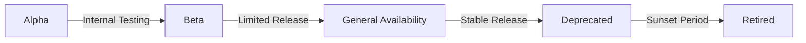

# Advanced API Management Features - Architecture & Design

## Executive Summary

This document outlines the design and implementation plan for advanced Azure API Management features including:
- **Comprehensive API Versioning Strategy** (URL, Header, Query-based)
- **Tiered Product Subscriptions** (Free, Basic, Standard, Premium, Enterprise)
- **Advanced Rate Limiting & Throttling** (Multi-tier quotas and policies)

## Current State Analysis

### Existing Setup
- Single API version (revision "1")
- Basic APIM configuration without products
- No rate limiting policies implemented
- No subscription tier management
- Developer Portal not configured for self-service

### Gaps Identified
1. No versioning strategy for API evolution
2. Missing product-based access control
3. No rate limiting or quota management
4. Lack of subscription tier differentiation
5. No developer self-service workflow

---

## 1. API Versioning Strategy

### Overview
Implement multiple versioning schemes to support different client needs and migration paths.

### Versioning Schemes

#### 1.1 URL Path Versioning (Primary - Recommended)
```
https://api.company.com/v1/users
https://api.company.com/v2/users
https://api.company.com/v3/users
```

**Benefits:**
- Clear and explicit version identification
- Easy for developers to understand
- Supports independent caching strategies
- Simple routing and analytics

**Use Cases:**
- Breaking changes in API contracts
- Major feature updates
- Long-term API lifecycle management

#### 1.2 Header Versioning (Secondary)
```http
GET https://api.company.com/users
Api-Version: 2024-01-15
```

**Benefits:**
- Clean URLs
- Suitable for minor version changes
- Good for internal APIs

**Use Cases:**
- Date-based versioning
- Incremental updates
- A/B testing scenarios

#### 1.3 Query String Versioning (Fallback)
```
https://api.company.com/users?api-version=2.0
```

**Benefits:**
- Easy to test in browsers
- Simple implementation
- Good for debugging

**Use Cases:**
- Testing and development
- Legacy system support
- Optional version overrides

### Version Lifecycle



### Version States

| State | Description | Availability | SLA | Support |
|-------|-------------|--------------|-----|---------|
| **Alpha** | Internal testing | Dev/Test only | None | Dev team only |
| **Beta** | Early access | Select partners | 95% | Limited support |
| **GA** | Production ready | All customers | 99.9% | Full support |
| **Deprecated** | Planned retirement | All customers | 99.5% | Bug fixes only |
| **Retired** | End of life | None | N/A | None |

### Versioning Best Practices

1. **Semantic Versioning for APIs:**
   - v1.0.0 - Major.Minor.Patch
   - Major: Breaking changes
   - Minor: New features (backward compatible)
   - Patch: Bug fixes

2. **Deprecation Timeline:**
   - Announce deprecation: 6 months before
   - Deprecation period: 12 months minimum
   - Sunset notification: 3 months before
   - Provide migration guide with announcement

3. **Version Headers in Responses:**
   ```http
   Api-Version: v2.1.0
   Api-Supported-Versions: v1.0.0, v2.0.0, v2.1.0
   Api-Deprecated-Versions: v1.0.0
   Api-Sunset-Date: 2025-12-31
   ```

---

## 2. Product Subscription Tiers

### Tier Overview

```
┌──────────────────────────────────────────────────────────────┐
│                    SUBSCRIPTION TIERS                         │
├──────────────────────────────────────────────────────────────┤
│                                                               │
│  FREE          →  BASIC        →  STANDARD    →  PREMIUM     │
│  Developer       Small Business   Professional   Enterprise  │
│  Testing         Getting Started  Production     Mission Crit│
│                                                               │
│  └─────────────────────────────────────────────────────────┘ │
└──────────────────────────────────────────────────────────────┘
```

### Detailed Tier Specifications

#### Tier 1: Free (Developer)
**Target Audience:** Developers, testing, proof-of-concept

| Feature | Limit |
|---------|-------|
| **Rate Limiting** | 10 calls/minute |
| **Daily Quota** | 1,000 calls/day |
| **Monthly Quota** | 10,000 calls/month |
| **Burst Allowance** | None |
| **API Access** | Public APIs only |
| **API Versions** | Latest stable (GA) only |
| **Response Caching** | None |
| **SLA** | None |
| **Support** | Community forum |
| **Analytics** | Basic (24h retention) |
| **Approval** | Automatic |
| **Cost** | $0/month |

**Use Cases:**
- API evaluation and testing
- Proof of concept development
- Educational purposes
- Open-source projects

#### Tier 2: Basic (Startup)
**Target Audience:** Small businesses, startups, side projects

| Feature | Limit |
|---------|-------|
| **Rate Limiting** | 100 calls/minute |
| **Daily Quota** | 50,000 calls/day |
| **Monthly Quota** | 500,000 calls/month |
| **Burst Allowance** | 2x for 10 seconds |
| **API Access** | All public APIs |
| **API Versions** | Current + 1 previous |
| **Response Caching** | 5 minutes default |
| **SLA** | 99.5% uptime |
| **Support** | Email (48h response) |
| **Analytics** | Standard (7 days) |
| **Approval** | Automatic |
| **Cost** | $49/month |

**Use Cases:**
- Production applications (low volume)
- Mobile apps
- Internal tools
- Small-scale B2B integrations

#### Tier 3: Standard (Professional)
**Target Audience:** Growing businesses, production workloads

| Feature | Limit |
|---------|-------|
| **Rate Limiting** | 500 calls/minute |
| **Daily Quota** | 500,000 calls/day |
| **Monthly Quota** | 5,000,000 calls/month |
| **Burst Allowance** | 3x for 30 seconds |
| **API Access** | All APIs (public + internal) |
| **API Versions** | All supported versions |
| **Response Caching** | Configurable (up to 1 hour) |
| **SLA** | 99.9% uptime |
| **Support** | Priority email + chat (12h) |
| **Analytics** | Advanced (30 days) |
| **Approval** | Manual review required |
| **Cost** | $299/month |

**Use Cases:**
- High-traffic web applications
- SaaS platforms
- Partner integrations
- Production microservices

#### Tier 4: Premium (Business)
**Target Audience:** Enterprise applications, mission-critical systems

| Feature | Limit |
|---------|-------|
| **Rate Limiting** | 2,000 calls/minute |
| **Daily Quota** | 5,000,000 calls/day |
| **Monthly Quota** | 50,000,000 calls/month |
| **Burst Allowance** | 5x for 1 minute |
| **API Access** | All APIs + Beta access |
| **API Versions** | All versions (including deprecated) |
| **Response Caching** | Fully configurable + CDN |
| **SLA** | 99.95% uptime |
| **Support** | 24/7 phone + dedicated account |
| **Analytics** | Custom dashboards (90 days) |
| **Approval** | SLA-based review |
| **Cost** | $1,499/month |

**Use Cases:**
- Enterprise applications
- High-volume B2B platforms
- Financial services
- Healthcare systems

#### Tier 5: Enterprise (Custom)
**Target Audience:** Large enterprises, custom requirements

| Feature | Limit |
|---------|-------|
| **Rate Limiting** | Custom negotiated |
| **Daily Quota** | Unlimited or custom |
| **Monthly Quota** | Unlimited or custom |
| **Burst Allowance** | Custom configured |
| **API Access** | Full access + private APIs |
| **API Versions** | All versions + early access |
| **Response Caching** | Dedicated cache + multi-region |
| **SLA** | 99.99% uptime + custom |
| **Support** | Dedicated team + on-site |
| **Analytics** | Custom BI integration + unlimited |
| **Approval** | Strategic partnership review |
| **Cost** | Custom pricing |

**Features:**
- Custom API development
- Dedicated infrastructure
- White-label solutions
- Private API endpoints
- Custom rate limits
- Multi-region deployment
- Priority feature requests

---

## 3. Rate Limiting & Throttling Framework

### Rate Limiting Strategy

```
┌─────────────────────────────────────────────────────────┐
│              RATE LIMITING HIERARCHY                    │
├─────────────────────────────────────────────────────────┤
│                                                         │
│  ┌──────────────┐                                       │
│  │ Subscription │  ← Primary limit (per tier)          │
│  │    Tier      │                                       │
│  └──────┬───────┘                                       │
│         │                                               │
│         ▼                                               │
│  ┌──────────────┐                                       │
│  │     API      │  ← Per-API limits                    │
│  │   Operation  │                                       │
│  └──────┬───────┘                                       │
│         │                                               │
│         ▼                                               │
│  ┌──────────────┐                                       │
│  │  Individual  │  ← User-specific overrides           │
│  │  Subscriber  │                                       │
│  └──────────────┘                                       │
└─────────────────────────────────────────────────────────┘
```

### Rate Limiting Dimensions

#### 3.1 By Time Window
- **Per Second:** Burst protection
- **Per Minute:** Standard rate limiting
- **Per Hour:** Medium-term quotas
- **Per Day:** Daily usage caps
- **Per Month:** Billing cycle limits

#### 3.2 By Resource Type

**Read Operations (GET):**
- Higher limits
- More lenient throttling
- Cacheable responses

**Write Operations (POST/PUT/DELETE):**
- Lower limits
- Stricter validation
- Audit logging

**Batch Operations:**
- Custom limits based on batch size
- Separate quota tracking

#### 3.3 By Consumer Type

**Authenticated Users:**
- Product tier-based limits
- Per-user tracking
- Grace period for bursts

**Anonymous/Public:**
- IP-based limiting
- More restrictive
- Require API key for higher limits

### Throttling Policies

#### Policy 1: Standard Rate Limit
```xml
<rate-limit calls="100" renewal-period="60" />
```

#### Policy 2: Quota Management
```xml
<quota calls="50000" renewal-period="86400" />
```

#### Policy 3: Advanced Throttling with Burst
```xml
<rate-limit-by-key 
    calls="100" 
    renewal-period="60" 
    counter-key="@(context.Subscription.Id)" 
    increment-condition="@(context.Response.StatusCode >= 200 && context.Response.StatusCode < 300)" />
```

#### Policy 4: Tiered Rate Limiting
```xml
<choose>
    <when condition="@(context.Product.Id == 'free')">
        <rate-limit calls="10" renewal-period="60" />
        <quota calls="1000" renewal-period="86400" />
    </when>
    <when condition="@(context.Product.Id == 'basic')">
        <rate-limit calls="100" renewal-period="60" />
        <quota calls="50000" renewal-period="86400" />
    </when>
    <when condition="@(context.Product.Id == 'standard')">
        <rate-limit calls="500" renewal-period="60" />
        <quota calls="500000" renewal-period="86400" />
    </when>
    <when condition="@(context.Product.Id == 'premium')">
        <rate-limit calls="2000" renewal-period="60" />
        <quota calls="5000000" renewal-period="86400" />
    </when>
    <otherwise>
        <rate-limit calls="10" renewal-period="60" />
    </otherwise>
</choose>
```

### Response Headers

**Rate Limit Information:**
```http
X-RateLimit-Limit: 100
X-RateLimit-Remaining: 87
X-RateLimit-Reset: 1635724800
X-RateLimit-Resource: api
X-RateLimit-Used: 13
X-Quota-Limit: 50000
X-Quota-Remaining: 48735
X-Quota-Reset: 1635811200
```

**Throttling Response (429):**
```http
HTTP/1.1 429 Too Many Requests
Content-Type: application/json
Retry-After: 60

{
  "error": {
    "code": "RateLimitExceeded",
    "message": "Rate limit exceeded. Try again in 60 seconds.",
    "details": {
      "limit": 100,
      "used": 100,
      "reset_time": "2024-11-01T12:00:00Z"
    }
  }
}
```

---

## 4. Implementation Architecture

### Component Diagram

```
┌──────────────────────────────────────────────────────────────┐
│                    APIM Architecture                          │
├──────────────────────────────────────────────────────────────┤
│                                                               │
│  ┌────────────────┐                                          │
│  │   Developer    │                                          │
│  │    Portal      │                                          │
│  └────────┬───────┘                                          │
│           │                                                   │
│           ▼                                                   │
│  ┌────────────────┐      ┌──────────────────┐               │
│  │  Subscription  │─────▶│  Product         │               │
│  │  Management    │      │  Configuration   │               │
│  └────────┬───────┘      └──────────────────┘               │
│           │                                                   │
│           ▼                                                   │
│  ┌─────────────────────────────────────────┐                │
│  │         API Management Gateway          │                │
│  ├─────────────────────────────────────────┤                │
│  │  ┌────────┐  ┌────────┐  ┌───────────┐ │                │
│  │  │ Rate   │  │ Quota  │  │ Caching   │ │                │
│  │  │ Limiter│  │ Manager│  │ Layer     │ │                │
│  │  └────────┘  └────────┘  └───────────┘ │                │
│  │  ┌────────┐  ┌────────┐  ┌───────────┐ │                │
│  │  │Version │  │ Policy │  │ Transform │ │                │
│  │  │Router  │  │ Engine │  │ Engine    │ │                │
│  │  └────────┘  └────────┘  └───────────┘ │                │
│  └─────────────────┬───────────────────────┘                │
│                    │                                         │
│                    ▼                                         │
│  ┌─────────────────────────────────────────┐                │
│  │        Backend APIs                     │                │
│  │  ┌──────┐  ┌──────┐  ┌──────┐          │                │
│  │  │ v1.0 │  │ v2.0 │  │ v3.0 │          │                │
│  │  └──────┘  └──────┘  └──────┘          │                │
│  └─────────────────────────────────────────┘                │
│                                                               │
└──────────────────────────────────────────────────────────────┘
```

### Data Flow

```
1. Developer subscribes to product tier via Portal
   └─> Subscription created with tier-specific limits

2. API request with subscription key
   └─> APIM validates key and retrieves product

3. Rate limiting check
   └─> Check calls against tier limits
   └─> Return 429 if exceeded

4. Version routing
   └─> Route to appropriate backend version
   └─> Apply version-specific transformations

5. Response caching
   └─> Cache based on tier settings
   └─> Return cached response if available

6. Analytics collection
   └─> Log request metrics
   └─> Update rate limit counters
   └─> Track usage for billing
```

---

## 5. Developer Portal Configuration

### Self-Service Features

#### Subscription Workflow
```
Developer Registration
     ↓
Email Verification
     ↓
Choose Product Tier
     ↓
Approval Process (if required)
     ↓
Subscription Keys Generated
     ↓
API Access Granted
```

### Portal Components

#### 5.1 Product Catalog
```html
<div class="product-catalog">
  <div class="product-card free">
    <h3>Free Tier</h3>
    <p class="price">$0/month</p>
    <ul class="features">
      <li>10 calls/minute</li>
      <li>1,000 calls/day</li>
      <li>Community support</li>
      <li>Public APIs only</li>
    </ul>
    <button>Get Started</button>
  </div>
  <!-- Other tiers... -->
</div>
```

#### 5.2 Interactive Console
- Try API endpoints directly
- Authentication pre-configured
- Request/response visualization
- Code generation in multiple languages

#### 5.3 Usage Dashboard
- Real-time rate limit status
- Historical usage charts
- Quota consumption tracking
- Billing projections

---

## 6. Monitoring & Analytics

### Key Metrics

#### Per-Tier Metrics
- API calls per tier
- Rate limit violations
- Quota utilization
- Average response time by tier
- Error rates by tier

#### Revenue Metrics
- Monthly recurring revenue by tier
- Tier upgrade/downgrade trends
- Customer lifetime value
- Churn rate by tier

#### Operational Metrics
- Cache hit ratio
- Backend latency
- APIM gateway performance
- Subscription approval times

### Alerting Strategy

**Critical Alerts:**
- APIM gateway down
- Rate limit system failure
- Authentication service unavailable

**Warning Alerts:**
- High rate limit violation rate
- Unusual API usage patterns
- Cache performance degradation
- Approaching quota limits (80%)

---

## 7. Migration & Rollout Strategy

### Phase 1: Infrastructure Setup (Week 1-2)
- Update Terraform for products and policies
- Configure rate limiting infrastructure
- Set up version management

### Phase 2: Product Configuration (Week 3)
- Create product tiers in APIM
- Configure subscription approval workflows
- Set up billing integration

### Phase 3: Policy Implementation (Week 4)
- Deploy rate limiting policies
- Test tier-specific limits
- Implement caching strategies

### Phase 4: Developer Portal (Week 5-6)
- Configure self-service subscription
- Create tier comparison pages
- Build usage dashboards

### Phase 5: API Versioning (Week 7-8)
- Implement v2 APIs
- Set up version routing
- Create migration documentation

### Phase 6: Testing & Validation (Week 9)
- Load testing per tier
- Subscription workflow testing
- Rate limit validation

### Phase 7: Rollout (Week 10)
- Soft launch to existing customers
- Monitor and adjust limits
- Collect feedback

### Phase 8: Full Launch (Week 11-12)
- Public announcement
- Marketing campaign
- Continuous optimization

---

## 8. Team Responsibilities

### API Governance Team
- Define product tier policies
- Approve tier limit changes
- Monitor compliance
- Review usage patterns

### Platform Team
- Implement infrastructure changes
- Deploy APIM configurations
- Monitor system health
- Scale resources as needed

### Developer Relations Team
- Configure Developer Portal
- Create documentation
- Handle subscription approvals
- Support developers

### Product Team
- Define pricing strategy
- Manage tier features
- Analyze usage data
- Plan tier improvements

---

## 9. Success Metrics

### Technical KPIs
- 99.9% API availability
- < 100ms APIM latency overhead
- < 1% rate limit false positives
- 90% cache hit ratio

### Business KPIs
- 100+ developers subscribed (6 months)
- 20% conversion free → paid
- $10K MRR from subscriptions
- < 5% monthly churn

### Developer Experience KPIs
- < 5 minutes to first API call
- > 4.0/5.0 developer satisfaction
- < 24h subscription approval
- > 80% documentation completeness

---

## 10. Next Steps

1. **Review this architecture document** with stakeholders
2. **Prioritize features** based on business needs
3. **Create detailed implementation tickets** in Azure DevOps
4. **Switch to Code mode** to implement infrastructure changes
5. **Iterative deployment** following the rollout strategy

---

## Appendices

### Appendix A: Policy Templates
See separate policy template file for complete APIM policy examples.

### Appendix B: Terraform Modules
Detailed Terraform configurations for products, APIs, and policies.

### Appendix C: Developer Portal Customization
Complete HTML/CSS/JavaScript customization guide.

### Appendix D: Migration Guides
Step-by-step guides for migrating existing customers to new tier system.

---

**Document Version:** 1.0  
**Last Updated:** 2025-10-09  
**Author:** Architecture Team  
**Review Date:** 2025-10-16