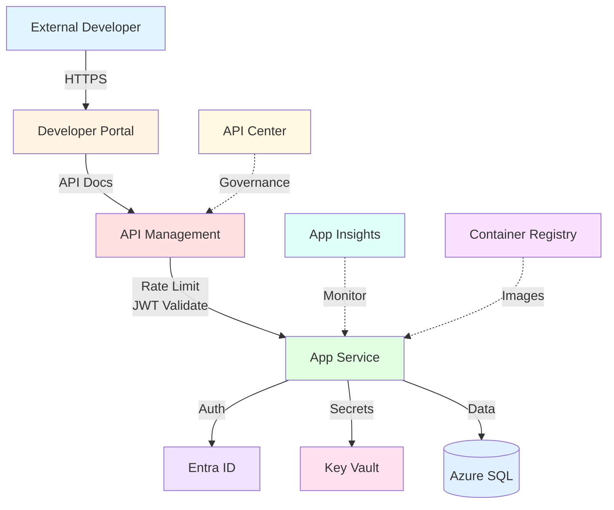
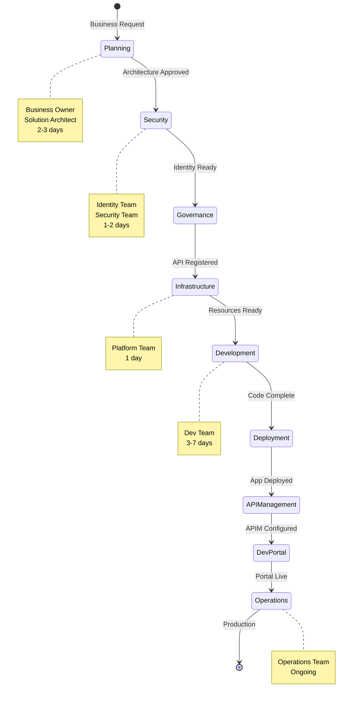
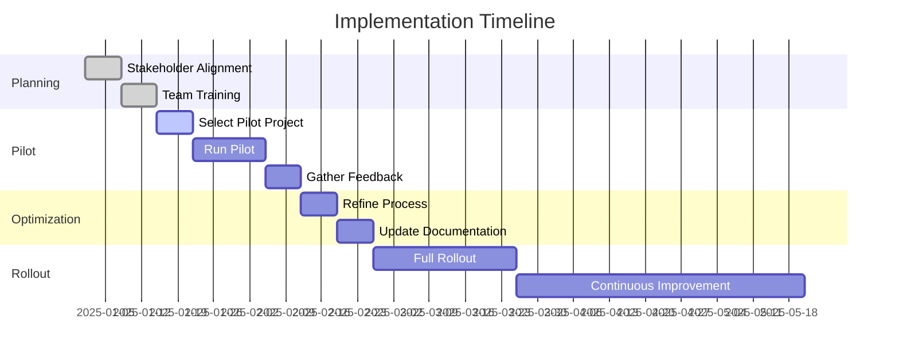

# Executive Summary - Visual Infographic

Visual representation of the Azure E2E Production Workflow for executives and stakeholders.

---

## 🎯 At a Glance

```
┌─────────────────────────────────────────────────────────────────────────┐
│                   AZURE E2E PRODUCTION WORKFLOW                         │
│                         At a Glance                                      │
└─────────────────────────────────────────────────────────────────────────┘

┌──────────────────────┐  ┌──────────────────────┐  ┌──────────────────────┐
│   📊 TIMELINE        │  │   👥 TEAMS           │  │   ✅ SUCCESS         │
│                      │  │                      │  │                      │
│  Simple: 1-2 weeks   │  │  11 Teams involved   │  │  99.9% Uptime       │
│  Standard: 2-3 weeks │  │  7 Workflow phases   │  │  40% Faster Deploy  │
│  Complex: 3-4 weeks  │  │  Hybrid security     │  │  Zero Security      │
│                      │  │  model               │  │  Incidents          │
└──────────────────────┘  └──────────────────────┘  └──────────────────────┘
```

---

## 📈 Business Value Dashboard

```
┌─────────────────────────────────────────────────────────────────────────┐
│                         BUSINESS IMPACT                                  │
├─────────────────────────────────────────────────────────────────────────┤
│                                                                          │
│  ⏱️  SPEED              🔒 SECURITY           💰 COST                   │
│  ═════════              ═════════            ═════                      │
│  40% faster             Zero incidents       15% reduction             │
│  deployment             from misconfig       in manual effort          │
│                                                                          │
│  📊 QUALITY             🌐 EXPERIENCE        📈 SCALABILITY             │
│  ═════════              ═════════            ═══════════                │
│  95% automation         Self-service         Repeatable for            │
│  success rate           developer portal     any application           │
│                                                                          │
└─────────────────────────────────────────────────────────────────────────┘
```

---

## 🏗️ Architecture Overview



---

## 👥 Team Ecosystem

```
┌─────────────────────────────────────────────────────────────────────────┐
│                         11 TEAMS WORKING TOGETHER                        │
├─────────────────────────────────────────────────────────────────────────┤
│                                                                          │
│  🏢 BUSINESS LAYER                                                      │
│  ├─ Business Owner ........ Defines requirements & approves             │
│  └─ Solution Architect ..... Designs technical architecture             │
│                                                                          │
│  🔐 SECURITY & IDENTITY (Hybrid Model)                                 │
│  ├─ Identity Team .......... Creates app registrations (Technical)      │
│  └─ Security Team .......... Approves permissions (Policy)              │
│                                                                          │
│  📋 GOVERNANCE                                                          │
│  └─ API Governance ......... Manages API standards & lifecycle          │
│                                                                          │
│  🛠️ ENGINEERING                                                         │
│  ├─ Platform Team .......... Provisions infrastructure (IaC)            │
│  ├─ Development Team ....... Builds applications                        │
│  └─ DevOps Team ............ Automates CI/CD pipelines                  │
│                                                                          │
│  🌐 API & EXPERIENCE                                                    │
│  ├─ API Management ......... Configures APIM policies                   │
│  └─ Developer Relations .... Manages Developer Portal                   │
│                                                                          │
│  📊 OPERATIONS                                                          │
│  └─ Operations Team ........ Monitors & responds to incidents           │
│                                                                          │
└─────────────────────────────────────────────────────────────────────────┘
```

---

## 🔄 Workflow Flow



---

## 🚦 Quality Gates

```
┌─────────────────────────────────────────────────────────────────────────┐
│                         7 QUALITY CHECKPOINTS                            │
└─────────────────────────────────────────────────────────────────────────┘

    START
      ⬇️
┌──────────────────┐
│ ✅ GATE 1        │  Requirements Complete
│ Business Owner   │  └─ All requirements documented
└────────┬─────────┘  └─ Budget approved
         ⬇️
┌──────────────────┐
│ ✅ GATE 2        │  Architecture Approved
│ Architect        │  └─ Design reviewed
└────────┬─────────┘  └─ Technology stack selected
         ⬇️
┌──────────────────┐
│ ✅ GATE 3        │  Security Approved
│ Security Team    │  └─ Permissions approved
└────────┬─────────┘  └─ Policies configured
         ⬇️
┌──────────────────┐
│ ✅ GATE 4        │  Infrastructure Ready
│ Platform Team    │  └─ Resources provisioned
└────────┬─────────┘  └─ Networking configured
         ⬇️
┌──────────────────┐
│ ✅ GATE 5        │  Application Deployed
│ DevOps Team      │  └─ Health checks passing
└────────┬─────────┘  └─ CI/CD successful
         ⬇️
┌──────────────────┐
│ ✅ GATE 6        │  API Ready
│ API Team         │  └─ APIM configured
└────────┬─────────┘  └─ Security validated
         ⬇️
┌──────────────────┐
│ ✅ GATE 7        │  Production Go-Live
│ Business Owner   │  └─ UAT complete
└────────┬─────────┘  └─ Monitoring active
         ⬇️
    🎉 PRODUCTION
```

---

## 📊 Success Metrics Dashboard

```
┌─────────────────────────────────────────────────────────────────────────┐
│                         KEY PERFORMANCE INDICATORS                       │
├─────────────────────────────────────────────────────────────────────────┤
│                                                                          │
│  DEPLOYMENT SPEED               SECURITY POSTURE                        │
│  ▓▓▓▓▓▓▓▓▓▓▓▓▓▓▓▓░░░░ 40%      ▓▓▓▓▓▓▓▓▓▓▓▓▓▓▓▓▓▓▓▓ 100%              │
│  Faster than before              Zero incidents                         │
│                                                                          │
│  AUTOMATION SUCCESS             UPTIME ACHIEVEMENT                      │
│  ▓▓▓▓▓▓▓▓▓▓▓▓▓▓▓▓▓▓▓░ 95%      ▓▓▓▓▓▓▓▓▓▓▓▓▓▓▓▓▓▓▓▓ 99.9%             │
│  Automated deployments           Production SLA                         │
│                                                                          │
│  DEVELOPER SATISFACTION         API RESPONSE TIME                       │
│  ▓▓▓▓▓▓▓▓▓▓▓▓▓▓▓▓▓░░░ 4.5/5    ▓▓▓▓▓▓▓▓▓▓▓▓▓▓▓░░░░░ <2s               │
│  Portal satisfaction             95th percentile                        │
│                                                                          │
└─────────────────────────────────────────────────────────────────────────┘
```

---

## 🛠️ Tools Integration Matrix

```
┌─────────────────────────────────────────────────────────────────────────┐
│                         INTEGRATED TOOLCHAIN                             │
└─────────────────────────────────────────────────────────────────────────┘

📋 PROJECT MANAGEMENT          🔐 SECURITY & IDENTITY
├─ Jira                       ├─ Entra ID (Azure AD)
├─ Azure DevOps               ├─ Key Vault
├─ Microsoft Teams            ├─ Conditional Access
└─ SharePoint                 └─ Managed Identity

💻 DEVELOPMENT                 ☁️ INFRASTRUCTURE
├─ Git / GitHub               ├─ Azure Portal
├─ VS Code                    ├─ Terraform
├─ Docker                     ├─ Azure CLI
└─ Postman                    └─ PowerShell

🌐 API & GOVERNANCE           📊 MONITORING
├─ Azure APIM                 ├─ Application Insights
├─ API Center                 ├─ Azure Monitor
├─ Developer Portal           ├─ Log Analytics
└─ OpenAPI/Swagger            └─ Dashboards
```

---

## 💰 Cost Savings & ROI

```
┌─────────────────────────────────────────────────────────────────────────┐
│                         RETURN ON INVESTMENT                             │
├─────────────────────────────────────────────────────────────────────────┤
│                                                                          │
│  BEFORE WORKFLOW              AFTER WORKFLOW                            │
│  ════════════════              ═════════════                            │
│                                                                          │
│  ⏰ 2 weeks average           ⏰ 1.2 weeks average (40% faster)         │
│  🐛 5 incidents/month         🐛 <1 incident/month (80% reduction)     │
│  👤 80 hrs manual work        👤 32 hrs manual work (60% reduction)    │
│  💰 High rework costs         💰 Minimal rework (95% first-time right) │
│  📉 Inconsistent quality      📈 Standardized quality                   │
│                                                                          │
│  ANNUAL SAVINGS: ~$500K       ROI TIMELINE: 6 months                   │
│                                                                          │
└─────────────────────────────────────────────────────────────────────────┘
```

---

## 🎯 Implementation Roadmap



---

## 📞 Quick Contact Matrix

```
┌─────────────────────────────────────────────────────────────────────────┐
│                         WHO TO CONTACT WHEN                              │
├─────────────────────────────────────────────────────────────────────────┤
│                                                                          │
│  🆘 PRODUCTION DOWN        → Operations On-Call (Teams #incidents)      │
│  🔒 SECURITY INCIDENT      → Security On-Call (security-oncall@...)     │
│  ❓ PROCESS QUESTION       → PMO Team (pmo@company.com)                 │
│  🚫 APPROVAL BLOCKED       → Team Lead (Direct message)                 │
│  🛠️ TOOL ACCESS           → IT Support (it-support@company.com)        │
│  📋 JIRA ISSUES           → Jira Support (jira-support@...)            │
│                                                                          │
│  Response Times:                                                         │
│  • Production: Immediate    • Security: <1 hour                         │
│  • Blockers: <2 hours      • Questions: <4 hours                        │
│                                                                          │
└─────────────────────────────────────────────────────────────────────────┘
```

---

## 🎓 Training Path

```
┌─────────────────────────────────────────────────────────────────────────┐
│                         ONBOARDING JOURNEY                               │
└─────────────────────────────────────────────────────────────────────────┘

WEEK 1: FOUNDATION
├─ Day 1: Read Executive Summary (this document)
├─ Day 2: Read your team-specific deck
├─ Day 3: Review quick reference materials
├─ Day 4: Attend workflow overview training
└─ Day 5: Q&A session with team lead

WEEK 2: PRACTICAL LEARNING
├─ Mon-Wed: Shadow experienced team member
├─ Thu-Fri: Participate in live workflow
└─ Review: Document learnings

WEEK 3: SUPERVISED WORK
├─ Handle first request with supervision
├─ Use all required tools
├─ Follow complete workflow
└─ Receive feedback

WEEK 4: INDEPENDENT
├─ Full independent work
├─ Contribute to improvements
└─ Ready to train others
```

---

## ✅ Next Actions

```
┌─────────────────────────────────────────────────────────────────────────┐
│                         IMMEDIATE NEXT STEPS                             │
├─────────────────────────────────────────────────────────────────────────┤
│                                                                          │
│  FOR EXECUTIVES                                                         │
│  ☐ Review this infographic                                             │
│  ☐ Approve workflow adoption                                           │
│  ☐ Assign executive sponsor                                            │
│  ☐ Allocate budget and resources                                       │
│                                                                          │
│  FOR TEAM LEADS                                                         │
│  ☐ Read full executive summary deck                                    │
│  ☐ Read your team-specific deck                                        │
│  ☐ Schedule team training                                              │
│  ☐ Identify pilot project                                              │
│                                                                          │
│  FOR TEAM MEMBERS                                                       │
│  ☐ Read your team deck                                                 │
│  ☐ Complete required training                                          │
│  ☐ Get tool access                                                     │
│  ☐ Join Teams channels                                                 │
│                                                                          │
└─────────────────────────────────────────────────────────────────────────┘
```

---

## 📊 Benefits Summary

```
                        WORKFLOW BENEFITS

        SPEED               QUALITY              SECURITY
    ⚡ 40% faster      ✅ 95% success       🔒 Zero incidents
    deployment          automated             from misconfig

        COST                SCALE              EXPERIENCE
    💰 60% less        📈 Repeatable        😊 Self-service
    manual effort       for any app          developer portal

             ⬇️ RESULT ⬇️
        
    🎯 Production-ready applications
    🎯 Proper governance & compliance
    🎯 Happy teams & customers
```

---

**Document Type**: Executive Visual Summary  
**Audience**: C-Level, Directors, Managers  
**Format**: Infographic / Visual Reference  
**Last Updated**: January 2025

**Full Documentation**: See `/communications/executive-summary-deck.md`

---

*This infographic provides a visual overview of the complete Azure E2E Production Workflow for quick executive review and decision-making.*
