# Quality Gates Automation Strategy

## Executive Summary

This document provides a comprehensive analysis of the 7 Quality Gates identified in the Azure E2E Production Workflow and presents actionable strategies for automating each checkpoint. The goal is to reduce manual intervention, accelerate deployment cycles, and maintain or improve quality standards.

**Key Finding:** 5 out of 7 quality gates can be substantially automated (70-100%), with 2 gates requiring hybrid automation (40-70% automated with human oversight).

---

## Overview of Current Quality Gates

Based on [`executive-summary-infographic.md`](communications/infographics/executive-summary-infographic.md:158-203), the workflow includes 7 quality checkpoints:

```
Gate 1: Requirements Complete       → Business Owner
Gate 2: Architecture Approved       → Architect
Gate 3: Security Approved           → Security Team
Gate 4: Infrastructure Ready        → Platform Team
Gate 5: Application Deployed        → DevOps Team
Gate 6: API Ready                   → API Team
Gate 7: Production Go-Live          → Business Owner
```

---

## Gate-by-Gate Automation Analysis

### GATE 1: Requirements Complete
**Owner:** Business Owner  
**Current State:** Manual approval  
**Automation Potential:** 40% (Hybrid - Automated verification + Human approval)

#### What Can Be Automated:
- ✅ Requirement document completeness check (all required fields filled)
- ✅ Budget allocation verification against system records
- ✅ Stakeholder sign-off tracking via workflow tools
- ✅ Template compliance validation
- ✅ Dependency identification and flagging

#### What Requires Human Judgment:
- ❌ Business value assessment
- ❌ Strategic alignment evaluation
- ❌ Final approval decision

#### Automation Strategy:

**Tools:**
- Azure DevOps Boards/Jira with custom workflows
- Power Automate for notifications
- SharePoint for document management
- Custom validation scripts

**Implementation:**

```yaml
# Azure DevOps Pipeline - Requirements Gate
trigger: none # Manual trigger

stages:
  - stage: RequirementsValidation
    jobs:
      - job: AutomatedChecks
        steps:
          - task: PowerShell@2
            displayName: 'Validate Requirements Completeness'
            inputs:
              targetType: 'inline'
              script: |
                # Check for required fields in requirements document
                $requirements = Get-Content requirements.json | ConvertFrom-Json
                
                $requiredFields = @('title', 'description', 'businessValue', 
                                   'budget', 'timeline', 'stakeholders')
                
                $missingFields = @()
                foreach ($field in $requiredFields) {
                    if (-not $requirements.$field) {
                        $missingFields += $field
                    }
                }
                
                if ($missingFields.Count -gt 0) {
                    Write-Error "Missing required fields: $($missingFields -join ', ')"
                    exit 1
                }
                
                Write-Host "✅ All required fields present"
          
          - task: PowerShell@2
            displayName: 'Verify Budget Allocation'
            inputs:
              targetType: 'inline'
              script: |
                # Integration with finance system API
                $budget = $(jq -r '.budget' requirements.json)
                $budgetApproved = Invoke-RestMethod -Uri "https://finance-api/verify-budget" `
                  -Method Post -Body @{amount=$budget} -ContentType 'application/json'
                
                if (-not $budgetApproved.approved) {
                    Write-Error "Budget not approved in finance system"
                    exit 1
                }
                
                Write-Host "✅ Budget verified and approved"
          
          - task: PowerShell@2
            displayName: 'Check Stakeholder Sign-offs'
            inputs:
              targetType: 'inline'
              script: |
                # Check for all required sign-offs
                $stakeholders = $(jq -r '.stakeholders[]' requirements.json)
                $signoffs = $(jq -r '.signoffs[]' requirements.json)
                
                $missingSignoffs = Compare-Object $stakeholders $signoffs | 
                  Where-Object {$_.SideIndicator -eq '<='} | Select-Object -ExpandProperty InputObject
                
                if ($missingSignoffs) {
                    Write-Warning "Missing sign-offs from: $($missingSignoffs -join ', ')"
                    # Send notification to pending stakeholders
                    exit 1
                }
                
                Write-Host "✅ All stakeholder sign-offs received"

      - job: HumanApproval
        dependsOn: AutomatedChecks
        pool: server
        steps:
          - task: ManualValidation@0
            displayName: 'Business Owner Final Approval'
            inputs:
              notifyUsers: |
                business-owner@company.com
              instructions: |
                Please review the automated validation results and approve if:
                - All automated checks have passed
                - Business value aligns with strategic goals
                - Budget allocation is appropriate
                
                Automated Validation Results: $(System.JobDisplayName)
```

**Benefits:**
- Reduces manual checking time by 60%
- Ensures consistency in requirements validation
- Provides audit trail of approval process
- Automates notifications to stakeholders

---

### GATE 2: Architecture Approved
**Owner:** Solution Architect  
**Current State:** Manual review  
**Automation Potential:** 50% (Hybrid - Automated validation + Architectural review)

#### What Can Be Automated:
- ✅ Architecture diagram completeness check
- ✅ Technology stack validation against approved list
- ✅ Security baseline compliance checking
- ✅ Cost estimation automation
- ✅ Scalability requirements validation
- ✅ Documentation completeness

#### What Requires Human Judgment:
- ❌ Design pattern appropriateness
- ❌ Long-term maintainability assessment
- ❌ Trade-off decisions
- ❌ Innovation and optimization opportunities

#### Automation Strategy:

**Tools:**
- Azure DevOps with custom gates
- Infrastructure-as-Code validators (Terraform validator, ARM template validator)
- Architecture Decision Records (ADR) templates
- Custom policy checking tools

**Implementation:**

```yaml
# Architecture Validation Pipeline
stages:
  - stage: ArchitectureValidation
    jobs:
      - job: AutomatedArchitectureChecks
        steps:
          - task: PowerShell@2
            displayName: 'Validate Architecture Documentation'
            inputs:
              targetType: 'inline'
              script: |
                # Check for required architecture artifacts
                $requiredFiles = @(
                  'architecture-diagram.png',
                  'architecture-decision-records/*.md',
                  'cost-estimate.xlsx',
                  'security-review.md',
                  'scalability-plan.md'
                )
                
                foreach ($file in $requiredFiles) {
                    if (-not (Test-Path $file)) {
                        Write-Error "Missing required file: $file"
                        exit 1
                    }
                }
                
                Write-Host "✅ All architecture documents present"
          
          - task: PowerShell@2
            displayName: 'Validate Technology Stack'
            inputs:
              targetType: 'inline'
              script: |
                # Validate against approved technology stack
                $proposedStack = Get-Content tech-stack.json | ConvertFrom-Json
                $approvedTechnologies = Get-Content approved-technologies.json | ConvertFrom-Json
                
                $unapproved = @()
                foreach ($tech in $proposedStack.technologies) {
                    if ($tech -notin $approvedTechnologies.list) {
                        $unapproved += $tech
                    }
                }
                
                if ($unapproved.Count -gt 0) {
                    Write-Warning "Unapproved technologies detected: $($unapproved -join ', ')"
                    Write-Warning "These require special approval from Architecture Review Board"
                    # Flag for manual review but don't fail
                }
                
                Write-Host "✅ Technology stack validated"
          
          - task: TerraformTaskV4@4
            displayName: 'Validate Terraform Configuration'
            inputs:
              provider: 'azurerm'
              command: 'validate'
              workingDirectory: 'terraform/'
          
          - task: PowerShell@2
            displayName: 'Cost Estimation'
            inputs:
              targetType: 'inline'
              script: |
                # Run Azure Cost Estimator
                az configure --defaults group=$(RESOURCE_GROUP_NAME)
                
                # Parse Terraform plan for cost estimation
                terraform plan -out=tfplan
                terraform show -json tfplan > plan.json
                
                # Use Infracost or similar tool
                infracost breakdown --path plan.json --format json > cost-estimate.json
                
                $estimatedCost = $(jq -r '.totalMonthlyCost' cost-estimate.json)
                $budgetLimit = $(jq -r '.budget.monthly' requirements.json)
                
                if ([decimal]$estimatedCost -gt [decimal]$budgetLimit) {
                    Write-Error "Estimated cost $$estimatedCost exceeds budget $$budgetLimit"
                    exit 1
                }
                
                Write-Host "✅ Cost estimate: $$estimatedCost (within budget)"
          
          - task: PowerShell@2
            displayName: 'Security Baseline Check'
            inputs:
              targetType: 'inline'
              script: |
                # Run security baseline checks
                # Check for:
                # - Managed identities usage
                # - Key Vault integration
                # - Network security groups
                # - Private endpoints
                # - Encryption at rest
                
                ./scripts/security-baseline-check.sh
                
                if ($LASTEXITCODE -ne 0) {
                    Write-Error "Security baseline validation failed"
                    exit 1
                }
                
                Write-Host "✅ Security baseline requirements met"

      - job: ArchitectReview
        dependsOn: AutomatedArchitectureChecks
        pool: server
        steps:
          - task: ManualValidation@0
            displayName: 'Architect Approval'
            inputs:
              notifyUsers: |
                solution-architect@company.com
                architecture-team@company.com
              instructions: |
                Automated validations completed successfully. Please review:
                
                ✅ All documentation present
                ✅ Technology stack validated
                ✅ Terraform configuration valid
                ✅ Cost estimate within budget
                ✅ Security baseline compliant
                
                Manual review required for:
                - Design pattern appropriateness
                - Scalability considerations
                - Maintainability assessment
                - Alternative solutions evaluation
                
                View full details: $(System.TeamFoundationCollectionUri)$(System.TeamProject)/_build/results?buildId=$(Build.BuildId)
```

**Benefits:**
- Catches common architecture issues automatically
- Reduces architect review time by 50%
- Ensures baseline compliance before human review
- Provides cost estimates automatically

---

### GATE 3: Security Approved
**Owner:** Security Team  
**Current State:** Manual security review  
**Automation Potential:** 70% (Highly automatable with manual oversight)

#### What Can Be Automated:
- ✅ Permission and role validation
- ✅ Policy configuration compliance
- ✅ Secrets management verification
- ✅ Network security configuration
- ✅ Encryption settings validation
- ✅ Vulnerability scanning
- ✅ Compliance framework checks (OWASP, CIS benchmarks)
- ✅ API security policy validation

#### What Requires Human Judgment:
- ❌ Risk assessment for novel patterns
- ❌ Exception approval for special cases
- ❌ Final sign-off on critical systems

#### Automation Strategy:

**Tools:**
- Microsoft Defender for Cloud
- Azure Policy
- Terraform Sentinel policies
- OWASP ZAP or similar security testing tools
- Secret scanning tools (GitGuardian, TruffleHog)
- Azure DevOps security scanning tasks

**Implementation:**

```yaml
# Security Validation Pipeline
stages:
  - stage: SecurityValidation
    jobs:
      - job: AutomatedSecurityChecks
        steps:
          - task: PowerShell@2
            displayName: 'Validate Entra ID Configuration'
            inputs:
              targetType: 'inline'
              script: |
                # Validate App Registration configuration
                az ad app show --id $(APP_REGISTRATION_ID) | jq '.'
                
                # Check required API permissions
                $requiredPermissions = @('User.Read', 'openid', 'profile')
                $configuredPermissions = az ad app permission list --id $(APP_REGISTRATION_ID) | 
                  jq -r '.[].resourceAccess[].id'
                
                foreach ($perm in $requiredPermissions) {
                    if ($perm -notin $configuredPermissions) {
                        Write-Error "Missing required permission: $perm"
                        exit 1
                    }
                }
                
                Write-Host "✅ Entra ID configuration validated"
          
          - task: PowerShell@2
            displayName: 'Scan for Secrets in Code'
            inputs:
              targetType: 'inline'
              script: |
                # Run secret scanning
                docker run --rm -v $(Build.SourcesDirectory):/src trufflesecurity/trufflehog:latest \
                  filesystem /src --json > secrets-scan.json
                
                $findings = Get-Content secrets-scan.json | ConvertFrom-Json
                
                if ($findings.Count -gt 0) {
                    Write-Error "⚠️ Secrets detected in code repository!"
                    Write-Error ($findings | ConvertTo-Json -Depth 10)
                    exit 1
                }
                
                Write-Host "✅ No secrets found in code"
          
          - task: AzurePowerShell@5
            displayName: 'Validate Key Vault Configuration'
            inputs:
              azureSubscription: $(AZURE_SUBSCRIPTION)
              ScriptType: 'InlineScript'
              Inline: |
                # Validate Key Vault security settings
                $kv = Get-AzKeyVault -VaultName $(KEY_VAULT_NAME)
                
                # Check soft delete enabled
                if (-not $kv.EnableSoftDelete) {
                    Write-Error "Key Vault must have soft delete enabled"
                    exit 1
                }
                
                # Check purge protection
                if (-not $kv.EnablePurgeProtection) {
                    Write-Warning "Key Vault should have purge protection enabled"
                }
                
                # Check network rules (should not be open to all)
                if ($kv.NetworkAcls.DefaultAction -eq 'Allow') {
                    Write-Error "Key Vault should not allow access from all networks"
                    exit 1
                }
                
                Write-Host "✅ Key Vault security configuration validated"
          
          - task: PowerShell@2
            displayName: 'OWASP Dependency Check'
            inputs:
              targetType: 'inline'
              script: |
                # Run OWASP dependency checker
                docker run --rm -v $(Build.SourcesDirectory):/src \
                  owasp/dependency-check:latest \
                  --scan /src \
                  --format JSON \
                  --out /src/dependency-check-report.json
                
                $report = Get-Content dependency-check-report.json | ConvertFrom-Json
                $criticalVulns = $report.dependencies | 
                  Where-Object {$_.vulnerabilities.severity -eq 'CRITICAL'}
                
                if ($criticalVulns.Count -gt 0) {
                    Write-Error "Critical vulnerabilities found in dependencies"
                    exit 1
                }
                
                Write-Host "✅ No critical vulnerabilities in dependencies"
          
          - task: AzureCLI@2
            displayName: 'Validate Terraform Security Configuration'
            inputs:
              azureSubscription: $(AZURE_SUBSCRIPTION)
              scriptType: 'bash'
              scriptLocation: 'inlineScript'
              inlineScript: |
                # Run Terraform security scanning with tfsec
                docker run --rm -v $(Build.SourcesDirectory)/terraform:/src \
                  aquasec/tfsec:latest /src --format json > tfsec-results.json
                
                critical_issues=$(jq '[.results[] | select(.severity=="CRITICAL")] | length' tfsec-results.json)
                
                if [ "$critical_issues" -gt 0 ]; then
                    echo "❌ Critical security issues found in Terraform configuration"
                    jq '.results[] | select(.severity=="CRITICAL")' tfsec-results.json
                    exit 1
                fi
                
                echo "✅ Terraform security validation passed"
          
          - task: PowerShell@2
            displayName: 'API Security Policy Check'
            inputs:
              targetType: 'inline'
              script: |
                # Validate APIM security policies
                $policies = Get-Content apim-policies.xml
                
                # Check for required policies
                $requiredPolicies = @(
                  'rate-limit',
                  'jwt-validate',
                  'cors',
                  'ip-filter'
                )
                
                foreach ($policy in $requiredPolicies) {
                    if ($policies -notmatch $policy) {
                        Write-Error "Missing required APIM policy: $policy"
                        exit 1
                    }
                }
                
                Write-Host "✅ APIM security policies validated"
          
          - task: PublishBuildArtifacts@1
            displayName: 'Publish Security Scan Results'
            inputs:
              PathtoPublish: '$(Build.SourcesDirectory)'
              ArtifactName: 'security-reports'
              
      - job: SecurityTeamReview
        dependsOn: AutomatedSecurityChecks
        condition: or(failed(), succeededOrFailed())
        pool: server
        steps:
          - task: ManualValidation@0
            displayName: 'Security Team Approval'
            inputs:
              notifyUsers: |
                security-team@company.com
                security-lead@company.com
              instructions: |
                Security automated checks completed. Results:
                
                ✅ Entra ID configuration validated
                ✅ No secrets in code
                ✅ Key Vault security configured
                ✅ No critical dependency vulnerabilities
                ✅ Terraform security validated
                ✅ APIM policies configured
                
                Please review full security reports and approve if acceptable:
                $(System.TeamFoundationCollectionUri)$(System.TeamProject)/_build/results?buildId=$(Build.BuildId)&view=artifacts
                
                Manual review required for:
                - Risk assessment
                - Exception requests
                - Compliance verification
```

**Benefits:**
- Automates 70% of security validation work
- Catches security issues early in the pipeline
- Provides consistent security baseline enforcement
- Reduces security review time from days to hours
- Comprehensive audit trail for compliance

---

### GATE 4: Infrastructure Ready
**Owner:** Platform Team  
**Automation Potential:** 90% (Highly automatable)

#### What Can Be Automated:
- ✅ Resource provisioning via IaC (Terraform)
- ✅ Configuration validation
- ✅ Network connectivity tests
- ✅ Resource health checks
- ✅ Naming convention compliance
- ✅ Tagging validation
- ✅ Cost allocation verification

#### What Requires Human Judgment:
- ❌ Final approval for production deployment (first time)

#### Automation Strategy:

**Tools:**
- Terraform with Azure Provider
- Azure CLI
- Custom validation scripts
- Terraform Cloud or Azure DevOps for state management

**Implementation:**

```yaml
# Infrastructure Deployment Pipeline
stages:
  - stage: InfrastructureDeployment
    jobs:
      - job: TerraformDeploy
        steps:
          - task: TerraformInstaller@0
            displayName: 'Install Terraform'
            inputs:
              terraformVersion: 'latest'
          
          - task: TerraformTaskV4@4
            displayName: 'Terraform Init'
            inputs:
              provider: 'azurerm'
              command: 'init'
              backendServiceArm: $(AZURE_SUBSCRIPTION)
              backendAzureRmResourceGroupName: 'terraform-state-rg'
              backendAzureRmStorageAccountName: 'tfstateaccount'
              backendAzureRmContainerName: 'tfstate'
              backendAzureRmKey: '$(Environment).terraform.tfstate'
              workingDirectory: 'terraform/'
          
          - task: TerraformTaskV4@4
            displayName: 'Terraform Validate'
            inputs:
              provider: 'azurerm'
              command: 'validate'
              workingDirectory: 'terraform/'
          
          - task: TerraformTaskV4@4
            displayName: 'Terraform Plan'
            inputs:
              provider: 'azurerm'
              command: 'plan'
              commandOptions: '-out=tfplan'
              environmentServiceNameAzureRM: $(AZURE_SUBSCRIPTION)
              workingDirectory: 'terraform/'
          
          - task: PowerShell@2
            displayName: 'Validate Naming Conventions'
            inputs:
              targetType: 'inline'
              script: |
                # Parse Terraform plan
                terraform show -json tfplan > plan.json
                
                # Validate naming conventions
                $resources = $(jq -r '.resource_changes[].change.after.name' plan.json)
                
                foreach ($resource in $resources) {
                    if ($resource -notmatch '^[a-z][a-z0-9-]{1,50}[a-z0-9]$') {
                        Write-Error "Resource name does not follow naming convention: $resource"
                        exit 1
                    }
                }
                
                Write-Host "✅ All resource names follow conventions"
              workingDirectory: 'terraform/'
          
          - task: PowerShell@2
            displayName: 'Validate Resource Tags'
            inputs:
              targetType: 'inline'
              script: |
                # Check required tags
                $requiredTags = @('Environment', 'Project', 'CostCenter', 'Owner')
                $resources = $(jq -r '.resource_changes[] | select(.type != "azurerm_resource_group")' plan.json)
                
                foreach ($resource in $resources) {
                    $tags = $(echo $resource | jq -r '.change.after.tags')
                    foreach ($tag in $requiredTags) {
                        if (-not ($tags | Select-String $tag)) {
                            Write-Error "Resource missing required tag '$tag': $($resource.address)"
                            exit 1
                        }
                    }
                }
                
                Write-Host "✅ All resources have required tags"
              workingDirectory: 'terraform/'
          
          - task: TerraformTaskV4@4
            displayName: 'Terraform Apply'
            inputs:
              provider: 'azurerm'
              command: 'apply'
              commandOptions: 'tfplan'
              environmentServiceNameAzureRM: $(AZURE_SUBSCRIPTION)
              workingDirectory: 'terraform/'
          
          - task: AzureCLI@2
            displayName: 'Validate Resource Health'
            inputs:
              azureSubscription: $(AZURE_SUBSCRIPTION)
              scriptType: 'bash'
              scriptLocation: 'inlineScript'
              inlineScript: |
                # Wait for resources to be fully provisioned
                sleep 30
                
                # Check App Service health
                app_state=$(az webapp show -n $(APP_NAME) -g $(RESOURCE_GROUP_NAME) --query state -o tsv)
                if [ "$app_state" != "Running" ]; then
                    echo "❌ App Service not in Running state: $app_state"
                    exit 1
                fi
                
                # Check APIM health
                apim_state=$(az apim show -n apim-$(APP_NAME) -g $(RESOURCE_GROUP_NAME) --query provisioningState -o tsv)
                if [ "$apim_state" != "Succeeded" ]; then
                    echo "❌ APIM provisioning failed: $apim_state"
                    exit 1
                fi
                
                # Check Key Vault accessibility
                az keyvault secret list --vault-name $(KEY_VAULT_NAME) > /dev/null
                if [ $? -ne 0 ]; then
                    echo "❌ Cannot access Key Vault"
                    exit 1
                fi
                
                echo "✅ All infrastructure resources healthy"
          
          - task: PowerShell@2
            displayName: 'Network Connectivity Tests'
            inputs:
              targetType: 'inline'
              script: |
                # Test connectivity between resources
                $appServiceUrl = "https://$(APP_NAME).azurewebsites.net"
                $apimUrl = $(terraform output -raw api_management_url)
                
                # Test App Service endpoint
                $response = Invoke-WebRequest -Uri "$appServiceUrl/health" -UseBasicParsing
                if ($response.StatusCode -ne 200) {
                    Write-Error "App Service health check failed"
                    exit 1
                }
                
                # Test APIM connectivity
                $response = Invoke-WebRequest -Uri "$apimUrl/health" -UseBasicParsing
                if ($response.StatusCode -ne 200) {
                    Write-Error "APIM health check failed"
                    exit 1
                }
                
                Write-Host "✅ Network connectivity validated"
          
          - task: PublishBuildArtifacts@1
            displayName: 'Publish Terraform Outputs'
            inputs:
              PathtoPublish: 'terraform/terraform.tfstate'
              ArtifactName: 'terraform-state'

      - job: PlatformTeamApproval
        dependsOn: TerraformDeploy
        condition: and(succeeded(), eq(variables['Environment'], 'production'))
        pool: server
        steps:
          - task: ManualValidation@0
            displayName: 'Platform Team Final Check'
            inputs:
              notifyUsers: 'platform-team@company.com'
              instructions: |
                Infrastructure deployment completed successfully:
                
                ✅ All resources provisioned
                ✅ Naming conventions validated
                ✅ Required tags present
                ✅ Resource health checks passed
                ✅ Network connectivity confirmed
                
                Please perform final review and approve for production.
```

**Benefits:**
- 90% automation rate - near fully automated
- Infrastructure deployment time reduced from 1 day to < 30 minutes
- Consistent and repeatable deployments
- Immediate validation of infrastructure health
- Comprehensive logging and audit trail

---

### GATE 5: Application Deployed
**Owner:** DevOps Team  
**Automation Potential:** 95% (Nearly fully automatable)

#### What Can Be Automated:
- ✅ Container build and push
- ✅ Application deployment
- ✅ Health check validation
- ✅ Smoke tests
- ✅ Database migrations
- ✅ Configuration validation
- ✅ Performance baseline tests

#### What Requires Human Judgment:
- ❌ Production deployment approval (first time or high-risk changes)

#### Automation Strategy:

**Tools:**
- Azure DevOps Pipelines
- Docker
- Azure Container Registry
- Health check endpoints
- Automated testing frameworks

**Implementation:**

```yaml
# Application Deployment Pipeline (already exists in azure-pipelines.yml, enhanced version)
trigger:
  - main

variables:
  azureServiceConnection: 'azure-service-connection'
  containerRegistry: '$(CONTAINER_REGISTRY_NAME).azurecr.io'
  imageRepository: '$(APP_NAME)'
  dockerfilePath: 'src/Dockerfile'
  tag: '$(Build.BuildId)'

stages:
  - stage: Build
    displayName: 'Build and Test'
    jobs:
      - job: BuildApplication
        displayName: 'Build .NET Application'
        pool:
          vmImage: 'ubuntu-latest'
        steps:
          - task: UseDotNet@2
            displayName: 'Install .NET SDK'
            inputs:
              version: '8.x'
          
          - task: DotNetCoreCLI@2
            displayName: 'Restore Dependencies'
            inputs:
              command: 'restore'
              projects: 'src/*.csproj'
          
          - task: DotNetCoreCLI@2
            displayName: 'Build Application'
            inputs:
              command: 'build'
              projects: 'src/*.csproj'
              arguments: '--configuration Release'
          
          - task: DotNetCoreCLI@2
            displayName: 'Run Unit Tests'
            inputs:
              command: 'test'
              projects: 'src/*.csproj'
              arguments: '--configuration Release --collect:"XPlat Code Coverage"'
          
          - task: PublishCodeCoverageResults@1
            displayName: 'Publish Code Coverage'
            inputs:
              codeCoverageTool: 'Cobertura'
              summaryFileLocation: '$(Agent.TempDirectory)/**/*coverage.cobertura.xml'
          
          - task: DotNetCoreCLI@2
            displayName: 'Publish Application'
            inputs:
              command: 'publish'
              publishWebProjects: true
              arguments: '--configuration Release --output $(Build.ArtifactStagingDirectory)'
              zipAfterPublish: false
      
      - job: BuildDockerImage
        displayName: 'Build Docker Image'
        dependsOn: BuildApplication
        pool:
          vmImage: 'ubuntu-latest'
        steps:
          - task: Docker@2
            displayName: 'Build Docker Image'
            inputs:
              command: 'build'
              repository: $(imageRepository)
              dockerfile: $(dockerfilePath)
              tags: |
                $(tag)
                latest
          
          - task: Docker@2
            displayName: 'Scan Docker Image for Vulnerabilities'
            inputs:
              command: 'run'
              arguments: '--rm aquasec/trivy:latest image $(imageRepository):$(tag)'
          
          - task: Docker@2
            displayName: 'Push to Container Registry'
            inputs:
              command: 'push'
              repository: $(imageRepository)
              containerRegistry: $(azureServiceConnection)
              tags: |
                $(tag)
                latest

  - stage: DeployDev
    displayName: 'Deploy to Development'
    dependsOn: Build
    condition: succeeded()
    jobs:
      - deployment: DeployToDev
        displayName: 'Deploy to Dev Environment'
        pool:
          vmImage: 'ubuntu-latest'
        environment: 'development'
        strategy:
          runOnce:
            deploy:
              steps:
                - task: AzureWebAppContainer@1
                  displayName: 'Deploy to App Service'
                  inputs:
                    azureSubscription: $(azureServiceConnection)
                    appName: $(APP_NAME)-dev
                    resourceGroupName: $(RESOURCE_GROUP_NAME)-dev
                    containers: $(container
Registry)/$(imageRepository):$(tag)
                
                - task: AzureCLI@2
                  displayName: 'Wait for Deployment'
                  inputs:
                    azureSubscription: $(azureServiceConnection)
                    scriptType: 'bash'
                    scriptLocation: 'inlineScript'
                    inlineScript: |
                      # Wait for app to restart
                      echo "Waiting for application to restart..."
                      sleep 60
                
                - task: PowerShell@2
                  displayName: 'Health Check Validation'
                  inputs:
                    targetType: 'inline'
                    script: |
                      $maxRetries = 10
                      $retryCount = 0
                      $healthCheckUrl = "https://$(APP_NAME)-dev.azurewebsites.net/health"
                      
                      while ($retryCount -lt $maxRetries) {
                          try {
                              $response = Invoke-WebRequest -Uri $healthCheckUrl -UseBasicParsing
                              if ($response.StatusCode -eq 200) {
                                  Write-Host "✅ Health check passed"
                                  $health = $response.Content | ConvertFrom-Json
                                  Write-Host "Application Status: $($health.status)"
                                  break
                              }
                          } catch {
                              Write-Host "Health check attempt $($retryCount + 1) failed, retrying..."
                              Start-Sleep -Seconds 10
                              $retryCount++
                          }
                      }
                      
                      if ($retryCount -eq $maxRetries) {
                          Write-Error "Health check failed after $maxRetries attempts"
                          exit 1
                      }
                
                - task: PowerShell@2
                  displayName: 'Run Smoke Tests'
                  inputs:
                    targetType: 'inline'
                    script: |
                      # Run basic smoke tests
                      $baseUrl = "https://$(APP_NAME)-dev.azurewebsites.net"
                      
                      # Test 1: Health endpoint
                      $health = Invoke-RestMethod -Uri "$baseUrl/health"
                      if ($health.status -ne "healthy") {
                          Write-Error "Health check failed"
                          exit 1
                      }
                      
                      # Test 2: API endpoint (authenticated)
                      # Add your smoke tests here
                      
                      Write-Host "✅ All smoke tests passed"
                
                - task: PublishTestResults@2
                  displayName: 'Publish Test Results'
                  inputs:
                    testResultsFormat: 'JUnit'
                    testResultsFiles: '**/test-results.xml'

  - stage: DeployProduction
    displayName: 'Deploy to Production'
    dependsOn: DeployDev
    condition: and(succeeded(), eq(variables['Build.SourceBranch'], 'refs/heads/main'))
    jobs:
      - deployment: DeployToProduction
        displayName: 'Deploy to Production'
        pool:
          vmImage: 'ubuntu-latest'
        environment: 'production'
        strategy:
          runOnce:
            deploy:
              steps:
                - task: AzureWebAppContainer@1
                  displayName: 'Deploy to Production App Service'
                  inputs:
                    azureSubscription: $(azureServiceConnection)
                    appName: $(APP_NAME)
                    resourceGroupName: $(RESOURCE_GROUP_NAME)
                    containers: $(containerRegistry)/$(imageRepository):$(tag)
                    slotName: 'staging'  # Deploy to staging slot first
                
                - task: AzureAppServiceManage@0
                  displayName: 'Warm up Staging Slot'
                  inputs:
                    azureSubscription: $(azureServiceConnection)
                    Action: 'Start Azure App Service'
                    WebAppName: $(APP_NAME)
                    SpecifySlotOrASE: true
                    ResourceGroupName: $(RESOURCE_GROUP_NAME)
                    Slot: 'staging'
                
                - task: PowerShell@2
                  displayName: 'Staging Slot Validation'
                  inputs:
                    targetType: 'inline'
                    script: |
                      $stagingUrl = "https://$(APP_NAME)-staging.azurewebsites.net"
                      
                      # Run comprehensive validation
                      $response = Invoke-RestMethod -Uri "$stagingUrl/health"
                      if ($response.status -ne "healthy") {
                          Write-Error "Staging slot health check failed"
                          exit 1
                      }
                      
                      # Performance baseline test
                      $start = Get-Date
                      Invoke-RestMethod -Uri "$stagingUrl/api/test" | Out-Null
                      $duration = (Get-Date) - $start
                      
                      if ($duration.TotalMilliseconds -gt 500) {
                          Write-Warning "Response time higher than expected: $($duration.TotalMilliseconds)ms"
                      }
                      
                      Write-Host "✅ Staging validation passed"
                
                - task: ManualValidation@0
                  displayName: 'Approve Production Swap'
                  condition: eq(variables['Environment'], 'production')
                  inputs:
                    notifyUsers: |
                      devops-team@company.com
                      platform-team@company.com
                    instructions: |
                      Deployment to staging slot completed successfully:
                      
                      ✅ Container deployed
                      ✅ Health checks passed
                      ✅ Smoke tests passed
                      ✅ Performance baseline validated
                      
                      Staging URL: https://$(APP_NAME)-staging.azurewebsites.net
                      
                      Approve to swap staging to production.
                
                - task: AzureAppServiceManage@0
                  displayName: 'Swap Staging to Production'
                  inputs:
                    azureSubscription: $(azureServiceConnection)
                    Action: 'Swap Slots'
                    WebAppName: $(APP_NAME)
                    ResourceGroupName: $(RESOURCE_GROUP_NAME)
                    SourceSlot: 'staging'
                    SwapWithProduction: true
                
                - task: PowerShell@2
                  displayName: 'Production Health Verification'
                  inputs:
                    targetType: 'inline'
                    script: |
                      $prodUrl = "https://$(APP_NAME).azurewebsites.net"
                      
                      # Wait for swap to complete
                      Start-Sleep -Seconds 30
                      
                      # Verify production
                      $maxRetries = 5
                      $retryCount = 0
                      
                      while ($retryCount -lt $maxRetries) {
                          try {
                              $response = Invoke-RestMethod -Uri "$prodUrl/health"
                              if ($response.status -eq "healthy") {
                                  Write-Host "✅ Production deployment successful"
                                  break
                              }
                          } catch {
                              Write-Host "Verification attempt $($retryCount + 1) failed, retrying..."
                              Start-Sleep -Seconds 10
                              $retryCount++
                          }
                      }
                      
                      if ($retryCount -eq $maxRetries) {
                          Write-Error "Production verification failed - initiating rollback"
                          # Trigger rollback
                          exit 1
                      }
```

**Benefits:**
- 95% automation - minimal manual intervention
- Deployment time reduced from hours to < 15 minutes
- Blue-green deployment strategy for zero-downtime
- Automated rollback capability
- Comprehensive health and smoke testing

---

### GATE 6: API Ready
**Owner:** API Team  
**Automation Potential:** 85% (Highly automatable)

#### What Can Be Automated:
- ✅ APIM policy deployment
- ✅ API configuration validation
- ✅ Security policy testing
- ✅ Rate limiting verification
- ✅ API versioning setup
- ✅ Documentation generation
- ✅ Developer Portal updates

#### What Requires Human Judgment:
- ❌ API design review (first time)
- ❌ Product tier approval

#### Automation Strategy:

**Tools:**
- Azure API Management
- OpenAPI/Swagger specifications
- Policy testing frameworks
- Automated API testing (Postman/Newman, RestAssured)

**Implementation:**

```yaml
# API Configuration Pipeline
stages:
  - stage: ConfigureAPIM
    displayName: 'Configure API Management'
    jobs:
      - job: DeployAPIMConfiguration
        steps:
          - task: AzureCLI@2
            displayName: 'Deploy APIM Policies'
            inputs:
              azureSubscription: $(AZURE_SUBSCRIPTION)
              scriptType: 'bash'
              scriptLocation: 'inlineScript'
              inlineScript: |
                # Deploy API policies from templates
                apim_name="apim-$(APP_NAME)"
                
                # Global policies
                az apim api policy create \
                  --resource-group $(RESOURCE_GROUP_NAME) \
                  --service-name $apim_name \
                  --api-id $(APP_NAME)-api \
                  --xml-content @apim-policies/global-policy.xml
                
                # Rate limiting policy
                az apim api operation policy create \
                  --resource-group $(RESOURCE_GROUP_NAME) \
                  --service-name $apim_name \
                  --api-id $(APP_NAME)-api \
                  --operation-id get-users \
                  --xml-content @apim-policies/rate-limit-policy.xml
                
                echo "✅ APIM policies deployed"
          
          - task: PowerShell@2
            displayName: 'Validate JWT Authentication'
            inputs:
              targetType: 'inline'
              script: |
                # Test JWT validation policy
                $apimUrl = "https://apim-$(APP_NAME).azure-api.net"
                
                # Test without token (should fail)
                try {
                    Invoke-RestMethod -Uri "$apimUrl/api/users"
                    Write-Error "API allowed unauthenticated request"
                    exit 1
                } catch {
                    if ($_.Exception.Response.StatusCode -eq 401) {
                        Write-Host "✅ Unauthenticated request correctly rejected"
                    } else {
                        throw
                    }
                }
                
                # Test with valid token
                $token = az account get-access-token --query accessToken -o tsv
                $headers = @{Authorization = "Bearer $token"}
                $response = Invoke-RestMethod -Uri "$apimUrl/api/users" -Headers $headers
                
                Write-Host "✅ JWT authentication working correctly"
          
          - task: PowerShell@2
            displayName: 'Test Rate Limiting'
            inputs:
              targetType: 'inline'
              script: |
                $apimUrl = "https://apim-$(APP_NAME).azure-api.net"
                $token = az account get-access-token --query accessToken -o tsv
                $headers = @{Authorization = "Bearer $token"}
                
                # Make requests to trigger rate limit
                $requestCount = 15  # Assuming 10 req/min limit
                $rateLimited = $false
                
                for ($i = 1; $i -le $requestCount; $i++) {
                    try {
                        Invoke-RestMethod -Uri "$apimUrl/api/users" -Headers $headers
                    } catch {
                        if ($_.Exception.Response.StatusCode -eq 429) {
                            Write-Host "Rate limit triggered at request $i"
                            $rateLimited = $true
                            break
                        }
                    }
                }
                
                if (-not $rateLimited) {
                    Write-Error "Rate limiting not working"
                    exit 1
                }
                
                Write-Host "✅ Rate limiting working correctly"
          
          - task: PowerShell@2
            displayName: 'Validate CORS Configuration'
            inputs:
              targetType: 'inline'
              script: |
                # Test CORS headers
                $apimUrl = "https://apim-$(APP_NAME).azure-api.net"
                $response = Invoke-WebRequest -Uri "$apimUrl/api/health" `
                  -Method Options `
                  -Headers @{
                    'Origin' = 'https://example.com'
                    'Access-Control-Request-Method' = 'GET'
                  } -UseBasicParsing
                
                if ($response.Headers['Access-Control-Allow-Origin'] -ne '*') {
                    Write-Error "CORS not configured correctly"
                    exit 1
                }
                
                Write-Host "✅ CORS configuration validated"
          
          - task: AzureCLI@2
            displayName: 'Update API Documentation'
            inputs:
              azureSubscription: $(AZURE_SUBSCRIPTION)
              scriptType: 'bash'
              scriptLocation: 'inlineScript'
              inlineScript: |
                # Generate OpenAPI spec from application
                app_url="https://$(APP_NAME).azurewebsites.net"
                curl -s "$app_url/swagger/v1/swagger.json" > openapi.json
                
                # Import to APIM
                az apim api import \
                  --resource-group $(RESOURCE_GROUP_NAME) \
                  --service-name apim-$(APP_NAME) \
                  --api-id $(APP_NAME)-api \
                  --path /api \
                  --specification-format OpenApi \
                  --specification-path openapi.json \
                  --subscription-required true
                
                echo "✅ API documentation updated"
          
          - task: PowerShell@2
            displayName: 'Update Developer Portal'
            inputs:
              targetType: 'inline'
              script: |
                # Auto-publish changes to Developer Portal
                az rest --method post `
                  --url "/subscriptions/$(SUBSCRIPTION_ID)/resourceGroups/$(RESOURCE_GROUP_NAME)/providers/Microsoft.ApiManagement/service/apim-$(APP_NAME)/contentTypes/document/contentItems/configuration?api-version=2021-08-01" `
                  --body '{"properties": {"autoPublish": true}}'
                
                Write-Host "✅ Developer Portal updated"
          
          - task: Newman@5
            displayName: 'Run API Integration Tests'
            inputs:
              collectionFileSource: 'file'
              collectionPath: 'postman/api-tests.json'
              environmentFileSource: 'file'
              environmentPath: 'postman/environment.json'
              reporterJUnit: true
              reporterJUnitExport: 'test-results/newman-results.xml'
          
          - task: PublishTestResults@2
            displayName: 'Publish API Test Results'
            inputs:
              testResultsFormat: 'JUnit'
              testResultsFiles: 'test-results/newman-results.xml'

      - job: APITeamApproval
        dependsOn: DeployAPIMConfiguration
        condition: and(succeeded(), eq(variables['FirstTimeDeployment'], 'true'))
        pool: server
        steps:
          - task: ManualValidation@0
            displayName: 'API Team Final Approval'
            inputs:
              notifyUsers: 'api-team@company.com'
              instructions: |
                API configuration completed successfully:
                
                ✅ APIM policies deployed
                ✅ JWT authentication validated
                ✅ Rate limiting verified
                ✅ CORS configuration validated
                ✅ Documentation updated
                ✅ Developer Portal published
                ✅ Integration tests passed
                
                Please review and approve for production.
```

**Benefits:**
- 85% automation of APIM configuration
- Automated policy deployment and testing
- Consistent API security enforcement
- Automated documentation updates
- Comprehensive API testing before production

---

### GATE 7: Production Go-Live
**Owner:** Business Owner  
**Automation Potential:** 60% (Hybrid - Automated validation + Business approval)

#### What Can Be Automated:
- ✅ UAT test execution
- ✅ Monitoring alert configuration
- ✅ Dashboard creation
- ✅ Performance baseline validation
- ✅ Backup verification
- ✅ Runbook deployment
- ✅ Documentation availability check

#### What Requires Human Judgment:
- ❌ Business readiness assessment
- ❌ Go/No-go decision
- ❌ Communication approval
- ❌ Final production sign-off

#### Automation Strategy:

**Tools:**
- Azure Monitor
- Application Insights
- Automated testing frameworks
- Documentation validation tools

**Implementation:**

```yaml
# Production Go-Live Validation Pipeline
stages:
  - stage: ProductionReadiness
    displayName: 'Production Readiness Validation'
    jobs:
      - job: AutomatedReadinessChecks
        steps:
          - task: PowerShell@2
            displayName: 'Run UAT Test Suite'
            inputs:
              targetType: 'inline'
              script: |
                # Execute comprehensive UAT tests
                dotnet test uat-tests/UATTestSuite.csproj `
                  --logger "trx;LogFileName=uat-results.trx" `
                  --configuration Release
                
                # Check test results
                $results = [xml](Get-Content TestResults/uat-results.trx)
                $total = $results.TestRun.ResultSummary.Counters.total
                $passed = $results.TestRun.ResultSummary.Counters.passed
                $failed = $results.TestRun.ResultSummary.Counters.failed
                
                Write-Host "UAT Results: $passed/$total passed, $failed failed"
                
                if ($failed -gt 0) {
                    Write-Error "UAT tests failed"
                    exit 1
                }
                
                Write-Host "✅ All UAT tests passed"
          
          - task: AzureCLI@2
            displayName: 'Verify Monitoring Configuration'
            inputs:
              azureSubscription: $(AZURE_SUBSCRIPTION)
              scriptType: 'bash'
              scriptLocation: 'inlineScript'
              inlineScript: |
                # Verify Application Insights is configured
                ai_instrumentation_key=$(az monitor app-insights component show \
                  --app ai-$(APP_NAME) \
                  --resource-group $(RESOURCE_GROUP_NAME) \
                  --query instrumentationKey -o tsv)
                
                if [ -z "$ai_instrumentation_key" ]; then
                    echo "❌ Application Insights not configured"
                    exit 1
                fi
                
                # Verify alerts are configured
                alert_count=$(az monitor metrics alert list \
                  --resource-group $(RESOURCE_GROUP_NAME) \
                  --query "length([?targetResourceType=='Microsoft.Web/sites'])" -o tsv)
                
                if [ "$alert_count" -lt 3 ]; then
                    echo "❌ Insufficient monitoring alerts configured"
                    exit 1
                fi
                
                echo "✅ Monitoring properly configured with $alert_count alerts"
          
          - task: PowerShell@2
            displayName: 'Verify Backup Configuration'
            inputs:
              targetType: 'inline'
              script: |
                # Check App Service backup configuration
                $backup = az webapp config backup list `
                  --webapp-name $(APP_NAME) `
                  --resource-group $(RESOURCE_GROUP_NAME) | ConvertFrom-Json
                
                if ($backup.Count -eq 0) {
                    Write-Error "No backup configured for App Service"
                    exit 1
                }
                
                # Check database backup
                $dbBackup = az sql db show `
                  --name $(DB_NAME) `
                  --server $(SQL_SERVER_NAME) `
                  --resource-group $(RESOURCE_GROUP_NAME) `
                  --query "earliestRestoreDate" -o tsv
                
                if ([string]::IsNullOrEmpty($dbBackup)) {
                    Write-Error "Database backup not configured"
                    exit 1
                }
                
                Write-Host "✅ Backup configuration verified"
          
          - task: PowerShell@2
            displayName: 'Validate Documentation'
            inputs:
              targetType: 'inline'
              script: |
                # Check for required documentation
                $requiredDocs = @(
                  'docs/deployment-guide.md',
                  'docs/runbook.md',
                  'docs/troubleshooting.md',
                  'docs/rollback-procedure.md',
                  'docs/monitoring-guide.md'
                )
                
                $missingDocs = @()
                foreach ($doc in $requiredDocs) {
                    if (-not (Test-Path $doc)) {
                        $missingDocs += $doc
                    }
                }
                
                if ($missingDocs.Count -gt 0) {
                    Write-Error "Missing documentation: $($missingDocs -join ', ')"
                    exit 1
                }
                
                Write-Host "✅ All required documentation present"
          
          - task: PowerShell@2
            displayName: 'Performance Baseline Validation'
            inputs:
              targetType: 'inline'
              script: |
                # Run performance baseline tests
                $baseUrl = "https://$(APP_NAME).azurewebsites.net"
                $iterations = 100
                $responseTimes = @()
                
                for ($i = 0; $i -lt $iterations; $i++) {
                    $start = Get-Date
                    Invoke-RestMethod -Uri "$baseUrl/api/health" | Out-Null
                    $duration = (Get-Date) - $start
                    $responseTimes += $duration.TotalMilliseconds
                }
                
                $avg = ($responseTimes | Measure-Object -Average).Average
                $p95 = $responseTimes | Sort-Object | Select-Object -Index ([int]($iterations * 0.95))
                
                Write-Host "Average response time: $([math]::Round($avg, 2))ms"
                Write-Host "P95 response time: $([math]::Round($p95, 2))ms"
                
                if ($p95 -gt 100) {
                    Write-Error "P95 response time exceeds target (100ms)"
                    exit 1
                }
                
                Write-Host "✅ Performance baseline validated"
          
          - task: PowerShell@2
            displayName: 'Create Production Dashboard'
            inputs:
              targetType: 'inline'
              script: |
                # Deploy monitoring dashboard
                az portal dashboard create `
                  --resource-group $(RESOURCE_GROUP_NAME) `
                  --name "$(APP_NAME)-production-dashboard" `
                  --input-path dashboards/production-dashboard.json
                
                Write-Host "✅ Production dashboard created"
          
          - task: PowerShell@2
            displayName: 'Generate Go-Live Report'
            inputs:
              targetType: 'inline'
              script: |
                # Generate comprehensive readiness report
                $report = @{
                    timestamp = Get-Date -Format "yyyy-MM-dd HH:mm:ss"
                    application = "$(APP_NAME)"
                    environment = "Production"
                    checks = @{
                        uatTests = "✅ Passed"
                        monitoring = "✅ Configured"
                        backup = "✅ Configured"
                        documentation = "✅ Complete"
                        performance = "✅ Validated"
                        dashboard = "✅ Created"
                    }
                    metrics = @{
                        testsPassed = "100%"
                        alertsConfigured = "3+"
                        avgResponseTime = "$avgms"
                        p95ResponseTime = "$p95ms"
                    }
                }
                
                $report | ConvertTo-Json -Depth 10 | Out-File go-live-report.json
                
                Write-Host "✅ Go-live report generated"
          
          - task: PublishBuildArtifacts@1
            displayName: 'Publish Go-Live Report'
            inputs:
              PathtoPublish: 'go-live-report.json'
              ArtifactName: 'go-live-report'

      - job: BusinessOwnerApproval
        dependsOn: AutomatedReadinessChecks
        pool: server
        steps:
          - task: ManualValidation@0
            displayName: 'Business Owner Go-Live Approval'
            inputs:
              notifyUsers: |
                business-owner@company.com
                product-manager@company.com
              instructions: |
                🎉 Production Go-Live Readiness Check Complete
                
                All automated validations passed:
                ✅ UAT tests completed (100% pass rate)
                ✅ Monitoring and alerts configured
                ✅ Backup systems verified
                ✅ Documentation complete
                ✅ Performance baseline validated
                ✅ Production dashboard deployed
                
                Performance Metrics:
                • Average response time: <50ms
                • P95 response time: <100ms
                • Uptime target: 99.9%
                
                Detailed report: $(System.TeamFoundationCollectionUri)$(System.TeamProject)/_build/results?buildId=$(Build.BuildId)&view=artifacts
                
                Please review and approve for production go-live.
                
                This is the final gate before production release.
```

**Benefits:**
- 60% automation of go-live checks
- Comprehensive readiness validation
- Automated report generation
- Clear go/no-go criteria
- Reduced risk of production issues

---

## Automation Architecture

### End-to-End Pipeline Flow

```mermaid
graph TB
    Start[Developer Commits Code] --> Gate1{Gate 1<br/>Requirements}
    Gate1 -->|Automated Check| Gate1Auto[Validate Completeness]
    Gate1Auto -->|Pass| Gate1Approve[Business Approval]
    Gate1Approve --> Gate2{Gate 2<br/>Architecture}
    
    Gate2 -->|Automated Check| Gate2Auto[Tech Stack<br/>Cost<br/>Security Baseline]
    Gate2Auto -->|Pass| Gate2Approve[Architect Review]
    Gate2Approve --> Gate3{Gate 3<br/>Security}
    
    Gate3 -->|Automated Check| Gate3Auto[Permissions<br/>Secrets<br/>Vulnerabilities<br/>Policies]
    Gate3Auto -->|Pass| Gate3Approve[Security Approval]
    Gate3Approve --> Gate4{Gate 4<br/>Infrastructure}
    
    Gate4 -->|Terraform| Gate4Auto[Provision<br/>Validate<br/>Test]
    Gate4Auto -->|Pass| Gate4Check[Platform Check]
    Gate4Check --> Gate5{Gate 5<br/>Application}
    
    Gate5 -->|CI/CD| Gate5Auto[Build<br/>Test<br/>Deploy<br/>Verify]
    Gate5Auto -->|Pass| Gate5Check[DevOps Check]
    Gate5Check --> Gate6{Gate 6<br/>API}
    
    Gate6 -->|APIM Config| Gate6Auto[Policies<br/>Security<br/>Docs<br/>Tests]
    Gate6Auto -->|Pass| Gate6Check[API Team Check]
    Gate6Check --> Gate7{Gate 7<br/>Go-Live}
    
    Gate7 -->|Validation| Gate7Auto[UAT<br/>Monitoring<br/>Backup<br/>Perf]
    Gate7Auto -->|Pass| Gate7Approve[Business Go-Live]
    Gate7Approve --> Production[🎉 Production]
    
    style Start fill:#e1f5ff
    style Production fill:#e1ffe1
    style Gate1 fill:#ffe1e1
    style Gate2 fill:#ffe1e1
    style Gate3 fill:#ffe1e1
    style Gate4 fill:#ffe1e1
    style Gate5 fill:#ffe1e1
    style Gate6 fill:#ffe1e1
    style Gate7 fill:#ffe1e1
    style Gate1Auto fill:#fff4e1
    style Gate2Auto fill:#fff4e1
    style Gate3Auto fill:#fff4e1
    style Gate4Auto fill:#fff4e1
    style Gate5Auto fill:#fff4e1
    style Gate6Auto fill:#fff4e1
    style Gate7Auto fill:#fff4e1
```



### Tool Stack

| Category | Tools | Purpose |
|----------|-------|---------|
| **CI/CD** | Azure DevOps, GitHub Actions | Pipeline orchestration |
| **IaC** | Terraform, ARM Templates | Infrastructure automation |
| **Security** | Microsoft Defender, tfsec, Trivy | Security scanning |
| **Testing** | Newman, k6, Playwright | Automated testing |
| **Monitoring** | App Insights, Azure Monitor | Health checking |
| **Documentation** | OpenAPI, Swagger | API documentation |
| **Validation** | Custom PowerShell/Bash scripts | Gate validation |

---

## Implementation Roadmap

### Phase 1: Foundation (Weeks 1-2)
**Goal:** Set up basic automation infrastructure

**Tasks:**
- [ ] Configure Azure DevOps pipelines
- [ ] Set up Terraform state management
- [ ] Create policy templates
- [ ] Set up monitoring baselines

**Deliverables:**
- Basic CI/CD pipeline operational
- Infrastructure-as-Code templates
- Monitoring dashboards

### Phase 2: Gate Automation (Weeks 3-6)
**Goal:** Implement automated quality gates

**Week 3: Gates 1-2**
- Implement requirements validation
- Architecture documentation checks
- Cost estimation automation

**Week 4: Gates 3-4**
- Security scanning integration
- Infrastructure provisioning automation
- Health check validation

**Week 5: Gates 5-6**
- Application deployment automation
- APIM configuration automation
- API testing framework

**Week 6: Gate 7**
- UAT automation
- Go-live readiness checks
- Reporting automation

### Phase 3: Integration & Testing (Week 7-8)
**Goal:** End-to-end testing and optimization

**Tasks:**
- [ ] Test complete pipeline flow
- [ ] Optimize execution time
- [ ] Add rollback capabilities
- [ ] Documentation updates

### Phase 4: Training & Rollout (Week 9-10)
**Goal:** Team enablement and production rollout

**Tasks:**
- [ ] Team training sessions
- [ ] Runbook creation
- [ ] Pilot project deployment
- [ ] Full production rollout

---

## Cost-Benefit Analysis

### Implementation Costs

| Item | Cost | Notes |
|------|------|-------|
| **Development Time** | $50,000 | 2 developers × 5 weeks |
| **Azure DevOps** | $1,500/year | 5 parallel jobs |
| **Security Tools** | $3,000/year | Trivy, tfsec licenses |
| **Testing Tools** | $2,000/year | Newman, k6 licenses |
| **Training** | $5,000 | Team training |
| **Total First Year** | **$61,500** | |
| **Annual Recurring** | **$6,500** | Years 2+ |

### Time Savings (Per Deployment)

| Gate | Manual Time | Automated Time | Savings |
|------|-------------|----------------|---------|
| Gate 1 | 4 hours | 1 hour | 3 hours |
| Gate 2 | 8 hours | 2 hours | 6 hours |
| Gate 3 | 16 hours | 3 hours | 13 hours |
| Gate 4 | 8 hours | 0.5 hours | 7.5 hours |
| Gate 5 | 6 hours | 0.5 hours | 5.5 
hours |
| Gate 6 | 4 hours | 0.5 hours | 3.5 hours |
| Gate 7 | 6 hours | 2 hours | 4 hours |
| **Total** | **52 hours** | **9.5 hours** | **42.5 hours** |

### Financial Impact

**Assumptions:**
- Average loaded developer cost: $100/hour
- Deployments per year: 50
- Error rate reduction: 80%
- Incident cost: $5,000 per incident

**Annual Savings:**

```
Time Savings:
42.5 hours × 50 deployments × $100/hour = $212,500

Error Prevention (incidents avoided):
Current: 5 incidents/month × 12 months = 60 incidents
With Automation: 12 incidents/year (80% reduction)
Avoided incidents: 48 × $5,000 = $240,000

Total Annual Savings: $452,500
```

**ROI Calculation:**

```
Year 1:
Investment: $61,500
Savings: $452,500
Net Benefit: $391,000
ROI: 636%

Year 2+:
Investment: $6,500
Savings: $452,500
Net Benefit: $446,000
ROI: 6,862%

Payback Period: < 2 months
```

---

## Risk Assessment

### Implementation Risks

#### High Priority Risks

**Risk 1: Pipeline Complexity**
- **Probability:** Medium
- **Impact:** High
- **Mitigation:**
  - Start with simple gates, add complexity gradually
  - Comprehensive documentation
  - Extensive testing in non-production
  - Rollback procedures for pipeline changes

**Risk 2: False Positives Blocking Production**
- **Probability:** Medium
- **Impact:** High
- **Mitigation:**
  - Manual override capability for all gates
  - Graduated rollout (dev → staging → prod)
  - Monitoring of gate success rates
  - Regular tuning of validation thresholds

**Risk 3: Tool Integration Failures**
- **Probability:** Low
- **Impact:** Medium
- **Mitigation:**
  - Redundant validation methods
  - Health checks for automation tools
  - Fallback to manual processes
  - Regular dependency updates

#### Medium Priority Risks

**Risk 4: Team Resistance to Automation**
- **Probability:** Medium
- **Impact:** Medium
- **Mitigation:**
  - Comprehensive training program
  - Involve teams in automation design
  - Gradual transition, not forced adoption
  - Clear communication of benefits

**Risk 5: Maintenance Overhead**
- **Probability:** Medium
- **Impact:** Low
- **Mitigation:**
  - Modular pipeline design
  - Comprehensive documentation
  - Designated automation champions per team
  - Regular reviews and updates

**Risk 6: Security Tool False Negatives**
- **Probability:** Low
- **Impact:** High
- **Mitigation:**
  - Multiple security scanning tools
  - Regular tool updates
  - Periodic manual security reviews
  - Security team oversight maintained

### Success Factors

**Critical Success Factors:**
1. ✅ Executive sponsorship and support
2. ✅ Dedicated automation team or resources
3. ✅ Comprehensive training program
4. ✅ Gradual, phased rollout
5. ✅ Clear metrics and monitoring
6. ✅ Continuous improvement culture

**Key Performance Indicators:**

| KPI | Target | Measurement Method |
|-----|--------|-------------------|
| Deployment Time | < 2 hours (from 52 hours) | Pipeline analytics |
| Automation Success Rate | > 90% | Gate pass/fail metrics |
| False Positive Rate | < 5% | Manual override tracking |
| Deployment Frequency | 2x increase | Release metrics |
| Incident Rate | 80% reduction | Operations data |
| Team Satisfaction | > 4/5 | Quarterly surveys |

---

## Recommendations

### Immediate Actions (Next 2 Weeks)

**Priority 1: Quick Wins**
1. ✅ Implement Gate 4 (Infrastructure) automation - already 90% automatable with existing Terraform
   - Update [`terraform/main.tf`](terraform/main.tf) with validation
   - Add health check scripts
   - Estimated time: 3 days
   - Immediate value: 7.5 hours saved per deployment

2. ✅ Implement Gate 5 (Application Deployment) automation - already partially automated
   - Enhance existing [`azure-pipelines.yml`](azure-pipelines.yml)
   - Add comprehensive health checks
   - Estimated time: 5 days
   - Immediate value: 5.5 hours saved per deployment

**Priority 2: Foundation**
3. Set up monitoring and dashboards for automated gates
4. Create rollback procedures
5. Document manual override processes

### Short-term Goals (Month 1-2)

**Week 1-2:**
- Implement Gates 4 & 5 (Infrastructure + Application)
- Set up basic monitoring
- Create documentation

**Week 3-4:**
- Implement Gate 3 (Security scanning)
- Add security policy automation
- Team training on new processes

**Week 5-6:**
- Implement Gate 6 (API configuration)
- APIM policy automation
- Integration testing

**Week 7-8:**
- Implement Gates 1, 2, 7 (hybrid gates)
- End-to-end testing
- Pilot deployment

### Medium-term Goals (Month 3-4)

- Optimize pipeline performance
- Reduce false positive rates
- Add advanced security scanning
- Implement chaos engineering tests
- Create comprehensive runbooks
- Scale to all projects

### Long-term Goals (Month 5-6)

- AI-powered anomaly detection
- Predictive failure analysis
- Self-healing automation
- Continuous optimization
- Platform extension to other applications

---

## Hybrid Automation Strategy

For gates that require human judgment, implement a **"Automation-First, Human-Validate" approach**:

### The Hybrid Model

```
┌─────────────────────────────────────────────┐
│     AUTOMATION DOES THE HEAVY LIFTING      │
├─────────────────────────────────────────────┤
│                                             │
│  1. Gather all relevant information         │
│  2. Run all automated validations           │
│  3. Generate comprehensive reports          │
│  4. Flag items needing human review         │
│  5. Provide recommendations                 │
│                                             │
└─────────────────┬───────────────────────────┘
                  │
                  ▼
┌─────────────────────────────────────────────┐
│      HUMANS FOCUS ON JUDGMENT CALLS        │
├─────────────────────────────────────────────┤
│                                             │
│  1. Review automated analysis               │
│  2. Make strategic decisions                │
│  3. Approve/reject with context             │
│  4. Handle exceptions                       │
│  5. Provide feedback for improvement        │
│                                             │
└─────────────────────────────────────────────┘
```

### Implementation Example: Gate 2 (Architecture)

**Automated Components (50%):**
```yaml
# Runs automatically, no human intervention
- Validate architecture documentation exists
- Check technology stack against approved list
- Run cost estimation
- Validate security baseline
- Check naming conventions
- Verify infrastructure code validity
```

**Human Review Components (50%):**
```yaml
# Requires architect judgment
Automated System Provides:
  - Architecture diagram
  - Technology choices with pros/cons
  - Cost estimate with breakdown
  - Security compliance report
  - Performance predictions
  - Alternative approaches (if any)

Architect Reviews:
  - Design pattern appropriateness
  - Long-term maintainability
  - Innovation opportunities
  - Trade-off decisions
  - Approves or requests changes
```

**Time Savings:**
- Manual process: 8 hours
- Automated prep: 2 hours (automated)
- Human review: 2 hours (focused review)
- **Total time: 4 hours (50% reduction)**

---

## Monitoring & Continuous Improvement

### Quality Gate Metrics Dashboard

```
┌────────────────────────────────────────────────────────┐
│         QUALITY GATES AUTOMATION DASHBOARD             │
├────────────────────────────────────────────────────────┤
│                                                        │
│  📊 Gate Success Rates (Last 30 Days)                 │
│  ├─ Gate 1: █████████████████░░ 90%                  │
│  ├─ Gate 2: █████████████████░░ 85%                  │
│  ├─ Gate 3: ███████████████████░ 95%                 │
│  ├─ Gate 4: ████████████████████ 98%                 │
│  ├─ Gate 5: ███████████████████░ 96%                 │
│  ├─ Gate 6: ███████████████████░ 92%                 │
│  └─ Gate 7: ████████████████░░░░ 88%                 │
│                                                        │
│  ⏱️ Average Gate Duration                              │
│  ├─ Before Automation: 52 hours                       │
│  ├─ After Automation: 9.5 hours                       │
│  └─ Time Saved: 42.5 hours (82%)                      │
│                                                        │
│  🚨 Issues & Interventions                            │
│  ├─ False Positives: 12 (5% rate)                    │
│  ├─ Manual Overrides: 8 (3% of deployments)          │
│  └─ Failed Gates: 15 (caught real issues)            │
│                                                        │
│  📈 Deployment Metrics                                 │
│  ├─ Deployments/Month: 12 → 24 (2x increase)         │
│  ├─ Lead Time: 2 weeks → 3 days (86% reduction)      │
│  └─ Incidents: 5/month → 1/month (80% reduction)     │
│                                                        │
└────────────────────────────────────────────────────────┘
```

### Continuous Improvement Process

**Weekly:**
- Review gate success/failure rates
- Analyze false positives
- Update validation rules
- Address automation bugs

**Monthly:**
- Review overall automation metrics
- Team feedback sessions
- Identify optimization opportunities
- Update documentation

**Quarterly:**
- Comprehensive automation review
- ROI calculation update
- Strategic improvements
- Tool evaluation and updates

---

## Team Training Plan

### Training Modules

**Module 1: Automation Overview (2 hours)**
- Why automate quality gates
- Overview of new pipeline
- Benefits and expectations
- Q&A

**Module 2: Team-Specific Training (4 hours)**
- Business Owner: Approval workflows
- Architects: Architecture validation tools
- Security Team: Security scanning integration
- Platform Team: Infrastructure automation
- DevOps Team: Pipeline management
- API Team: APIM configuration
- Operations Team: Monitoring and alerts

**Module 3: Hands-On Workshop (4 hours)**
- Deploy sample application through pipeline
- Experience each gate
- Practice manual overrides
- Troubleshooting common issues

**Module 4: Advanced Topics (2 hours)**
- Pipeline customization
- Adding new validation rules
- Troubleshooting failures
- Best practices

### Training Schedule

**Week 1:**
- Monday: Executive briefing
- Wednesday: Module 1 for all teams
- Friday: Module 2 (Business/Arch/Security)

**Week 2:**
- Monday: Module 2 (Platform/DevOps/API/Ops)
- Wednesday: Module 3 (Hands-on workshop)
- Friday: Module 4 (Advanced topics)

---

## Rollback & Disaster Recovery

### Automated Rollback Scenarios

**Scenario 1: Gate Failure (Non-Critical)**
```
Detection: Gate validation fails
Action: Stop pipeline, notify owner
Manual: Review failure, fix issue, retry
```

**Scenario 2: Production Deployment Failure**
```
Detection: Health checks fail after deployment
Action: 
  1. Automatic rollback to previous version
  2. Alert operations team
  3. Create incident ticket
  4. Preserve logs for investigation
Manual: Investigate root cause, fix, redeploy
```

**Scenario 3: Security Vulnerability Detected**
```
Detection: Security scanner finds critical vulnerability
Action:
  1. Stop pipeline immediately
  2. Alert security team (high priority)
  3. Quarantine artifacts
  4. Create security incident
Manual: Security team reviews, provides guidance
```

**Scenario 4: Infrastructure Provisioning Failure**
```
Detection: Terraform apply fails
Action:
  1. Preserve state
  2. Run terraform destroy (if partial)
  3. Alert platform team
  4. Prevent further deployments
Manual: Platform team investigates and fixes
```

### Manual Override Procedures

**When to Use Manual Override:**
- False positive from automated checks
- Emergency hotfix deployment
- Approved exception case
- Testing new validation rules

**Override Process:**
1. Document reason for override
2. Get approval from team lead
3. Execute override in pipeline
4. Track in metrics
5. Post-deployment review

**Override Tracking:**
```yaml
# All overrides logged to audit trail
{
  "timestamp": "2025-10-14T10:30:00Z",
  "gate": "Gate 3 - Security",
  "reason": "False positive - known issue #1234",
  "approver": "security-lead@company.com",
  "deployment": "DEP-2025-1014-001",
  "result": "Success"
}
```

---

## Success Stories & Expected Outcomes

### Projected Outcomes

**Month 1-2:**
- ✅ Gates 4 & 5 automated
- ✅ Deployment time reduced by 40%
- ✅ Team trained on new process
- ✅ 10+ successful automated deployments

**Month 3-4:**
- ✅ All gates automated
- ✅ Deployment time reduced by 80%
- ✅ Incident rate reduced by 50%
- ✅ Team satisfaction improved
- ✅ 40+ successful automated deployments

**Month 5-6:**
- ✅ Full automation maturity
- ✅ Deployment frequency doubled
- ✅ Incident rate reduced by 80%
- ✅ ROI targets exceeded
- ✅ Process extended to other projects

### Expected Business Impact

**Speed:**
- Deployment cycle time: 2-3 weeks → 2-3 days
- Time to market: 40% faster
- Deployment frequency: 2x increase

**Quality:**
- Pre-production defects caught: 95%
- Production incidents: 80% reduction
- Security vulnerabilities: Caught before production

**Cost:**
- Manual effort: 60% reduction
- Incident costs: 80% reduction
- Annual savings: $452,500

**Team Satisfaction:**
- Less manual, repetitive work
- More time for innovation
- Faster feedback loops
- Reduced deployment stress

---

## Conclusion

The automation of Quality Gates in the Azure E2E Production Workflow is both **technically feasible and financially compelling**:

### Key Findings

1. **High Automation Potential**
   - 5 out of 7 gates can be 70-95% automated
   - 2 gates benefit from hybrid automation (40-60%)
   - Overall automation potential: ~75%

2. **Significant Time Savings**
   - Manual process: 52 hours per deployment
   - Automated process: 9.5 hours per deployment
   - Time saved: 42.5 hours (82% reduction)

3. **Strong Financial Case**
   - Annual savings: $452,500
   - First-year investment: $61,500
   - ROI: 636% (Year 1), 6,862% (Year 2+)
   - Payback period: < 2 months

4. **Manageable Risks**
   - Well-defined mitigation strategies
   - Gradual rollout reduces risk
   - Fallback to manual processes available
   - Comprehensive monitoring and alerting

### Recommended Approach

**Phase 1: Quick Wins (Weeks 1-2)**
- Automate Gates 4 & 5 (Infrastructure + Application)
- Already 90-95% automatable
- Immediate value demonstration

**Phase 2: Security & API (Weeks 3-6)**
- Automate Gates 3 & 6 (Security + API)
- High automation potential (70-85%)
- Significant risk reduction

**Phase 3: Hybrid Gates (Weeks 7-8)**
- Implement automation-assisted Gates 1, 2, 7
- Focus on information gathering and validation
- Preserve human judgment where needed

**Phase 4: Optimization (Weeks 9-10)**
- Fine-tune all gates
- Reduce false positives
- Team training and adoption
- Scale to additional projects

### Next Steps

1. **Immediate (This Week):**
   - Review and approve this strategy document
   - Assign project team and resources
   - Schedule kickoff meeting

2. **Week 1-2:**
   - Begin Phase 1 implementation
   - Set up monitoring infrastructure
   - Create initial documentation

3. **Week 3-4:**
   - Continue implementation
   - Conduct team training
   - Pilot with first project

4. **Month 2:**
   - Full rollout to production
   - Monitor and optimize
   - Collect feedback and iterate

---

## Appendix

### A. Tool Comparison Matrix

| Tool | Purpose | Cost | Pros | Cons |
|------|---------|------|------|------|
| **Azure DevOps** | CI/CD Platform | $30-52/user/month | Native Azure integration, Comprehensive | Can be complex |
| **GitHub Actions** | CI/CD Platform | Free-$21/user/month | Easy to use, Large community | Less Azure-native |
| **Terraform** | Infrastructure as Code | Free (Open Source) | Industry standard, Multi-cloud | Learning curve |
| **Microsoft Defender** | Security Scanning | Included with Azure | Native integration, Comprehensive | Azure-only |
| **Trivy** | Container Scanning | Free (Open Source) | Fast, Accurate | Command-line only |
| **Newman** | API Testing | Free (Open Source) | Postman integration, Easy | Limited features |
| **k6** | Load Testing | Free-$49/user/month | Scalable, JavaScript | Requires coding |

### B. Reference Implementation

Complete working examples available in:
- [`azure-pipelines.yml`](azure-pipelines.yml) - Basic CI/CD pipeline
- [`terraform/main.tf`](terraform/main.tf) - Infrastructure automation
- [`scripts/deploy-infrastructure.sh`](scripts/deploy-infrastructure.sh) - Deployment script
- [`scripts/test-endpoints.sh`](scripts/test-endpoints.sh) - Health check script

### C. Additional Resources

**Documentation:**
- [Azure DevOps Documentation](https://docs.microsoft.com/azure/devops)
- [Terraform Azure Provider](https://registry.terraform.io/providers/hashicorp/azurerm/latest/docs)
- [APIM Policies Reference](https://docs.microsoft.com/azure/api-management/api-management-policies)

**Training:**
- Microsoft Learn: DevOps courses
- HashiCorp Learn: Terraform
- OWASP: Security best practices

---

**Document Version:** 1.0  
**Created:** 2025-10-14  
**Author:** Architecture Team  
**Status:** Ready for Review  
**Next Review:** Post-implementation (Week 12)

---

*This automation strategy provides a comprehensive, actionable plan to transform manual quality gates into an efficient, automated workflow that maintains quality while dramatically reducing deployment time and costs.*